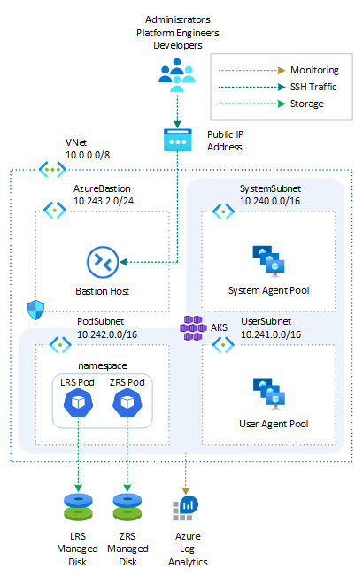
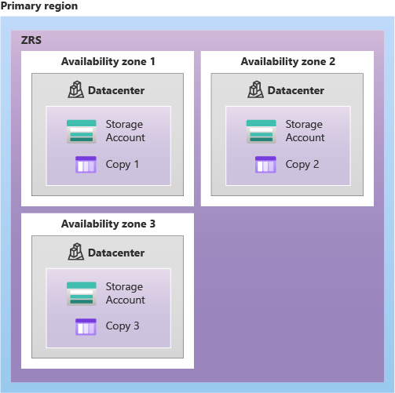
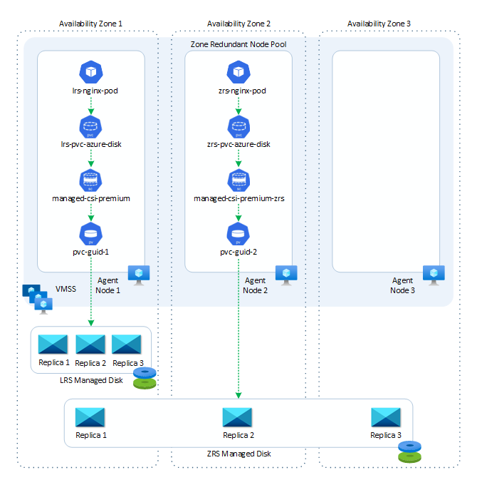
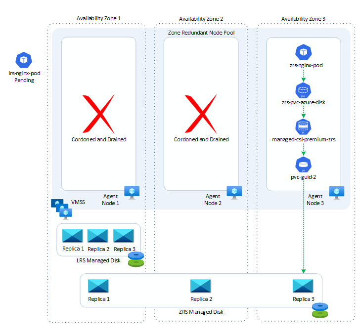
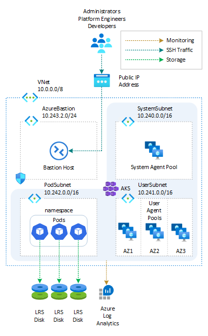
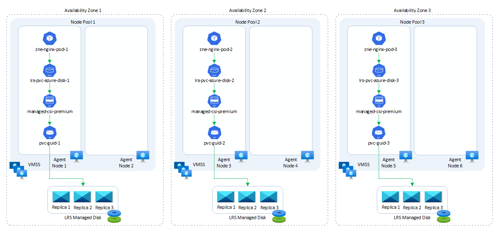
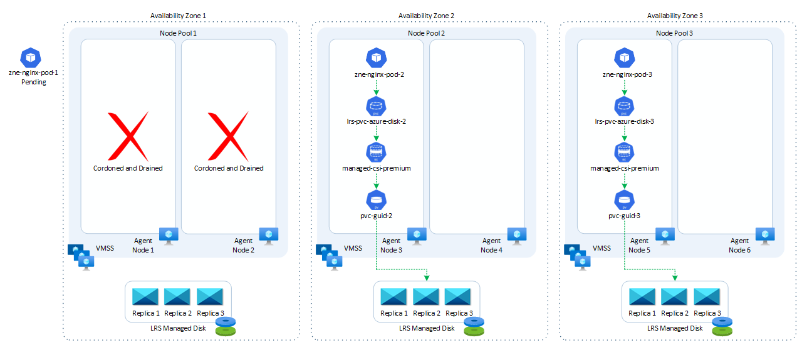
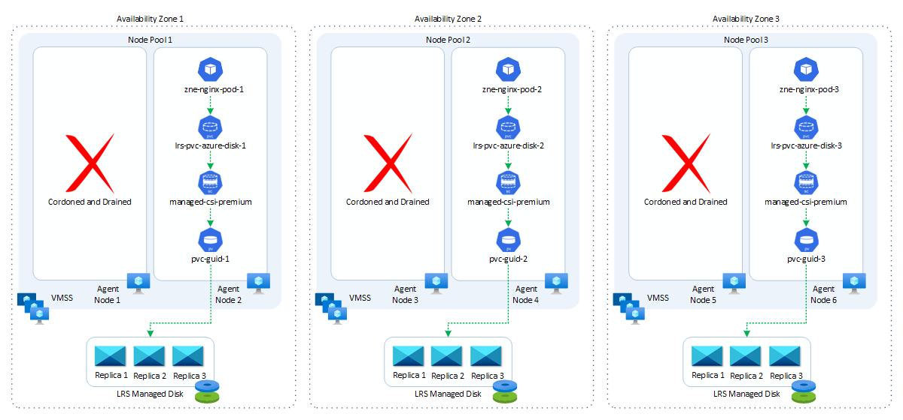

# A Practical Guide to Zone Redundant AKS Clusters and Storage

Resilience is a critical aspect of any modern application infrastructure. When failures occur, a resilient solution is capable of recovering quickly and maintaining functionality. To enhance the intra-region resiliency of an [Azure Kubernetes Service (AKS)](https://learn.microsoft.com/en-us/azure/aks/intro-kubernetes) cluster, creating a zone redundant cluster is of utmost importance. This article explains how you can create a zone redundant AKS cluster and the implications of each approach on the deployment strategy and  configuration of the persistent volumes used by the workloads.



## Prerequisites

- An active [Azure subscription](https://docs.microsoft.com/en-us/azure/guides/developer/azure-developer-guide#understanding-accounts-subscriptions-and-billing). If you don't have one, create a [free Azure account](https://azure.microsoft.com/free/) before you begin.
- [Visual Studio Code](https://code.visualstudio.com/) installed on one of the [supported platforms](https://code.visualstudio.com/docs/supporting/requirements#_platforms) along with the [HashiCorp Terraform](https://marketplace.visualstudio.com/items?itemName=HashiCorp.terraform).
- Azure CLI version 2.56.0 or later installed. To install or upgrade, see [Install Azure CLI](https://learn.microsoft.com/en-us/cli/azure/install-azure-cli).
- `aks-preview` Azure CLI extension of version 0.5.140 or later installed
- The deployment must be started by a user who has sufficient permissions to assign roles, such as a `User Access Administrator` or `Owner`.
- Your Azure account also needs `Microsoft.Resources/deployments/write` permissions at the subscription level.

## Availability Zones

[Availability Zones](https://learn.microsoft.com/en-us/azure/reliability/availability-zones-overview?tabs=azure-cli) are separate groups of datacenters in a region. They are located close enough to have fast connections to each other, with a round-trip latency of less than 2ms. However, they are also far enough apart to minimize the chances of all zones being affected by local issues or bad weather. Each availability zone has its own power, cooling, and networking systems. If one zone goes down, the other zones can still support regional services, capacity, and high availability. This setup helps ensure that your data remains synchronized and accessible even during unexpected events. The diagram below illustrates examples of Azure regions, with Regions 1 and 2 being equipped with availability zones.


Not all the Azure regions support availability zones. For more information on which regions support Availability Zones, you can refer to the [Availability zone service and regional support](https://learn.microsoft.com/en-us/azure/reliability/availability-zones-service-support) documentation.

## Azure services with availability zone support

Azure is continuously expanding its range of services that support availability zones. These services can be divided into three types: zonal, zone-redundant, and always-available.

- **Zonal services** allow you to deploy resources to a specific availability zone of your choice, ensuring optimal performance and low latency. Resiliency is achieved by replicating applications and data across multiple zones within the same region. For example, you can align the agent nodes of an AKS node pool and the managed disks created via persistent volume claims to a specific zone, increasing resilience by deploying multiple instances of resources across different zones.
- **Zone-redundant services** automatically distribute or replicate resources across multiple availability zones. This ensures that even if one zone fails, the data remains highly available. For instance, you can create a zone-redundant VMSS-based node pool where the nodes are spread across availability zones within a region.
- **Always-available services** are resilient to both zone-wide and region-wide outages. These services are available across all Azure geographies and provide uninterrupted availability. For a comprehensive list of always-available services, also known as non-regional services, you can refer to the [Products available by region](https://azure.microsoft.com/global-infrastructure/services/) documentation on Azure.

## Maximizing Resilience with Availability Zones

By utilizing Availability Zones, the resilience of an AKS cluster can be greatly improved. When creating an AKS cluster, spreading the AKS agent nodes across multiple zones can enhance the cluster's resilience within a region. This involves distributing AKS agent nodes across physically separate data centers, ensuring that nodes in one pool continue running even if another zone encounters failures. If co-locality requirements exist, there are two options available:

1. **Regular VMSS-based AKS Deployment**: This involves deploying the AKS cluster or one of its node pools into a single Availability Zone, ensuring proximity and minimizing internode latency.
2. **Proximity Placement Groups**: [Proximity Placement Groups (PPG)](https://learn.microsoft.com/en-us/azure/aks/reduce-latency-ppg) can be utilized to minimize internode latency while maintaining zone redundancy. Nodes within a PPG are placed in the same data center, ensuring optimal communication and minimizing latency.

## Creating Zone Redundant AKS Clusters

There are two approaches to creating a zone redundant AKS cluster:

1. **Zone Redundant Node Pool**: Another approach involves creating a zone redundant node pool, where nodes are spread across multiple Availability Zones. This ensures that the node pool can withstand failures in any zone while maintaining the desired functionality.
2. **AKS Cluster with three Node Pools**: In this approach, an AKS cluster is created with three node pools, each assigned to a different [availability zone](https://learn.microsoft.com/en-us/azure/reliability/availability-zones-overview?tabs=azure-cli). This ensures that the cluster has redundancy across zones.

Let's explore the implications on workload deployment strategy and storage configuration for these two strategies.

## Azure Storage redundancy

Azure Storage always stores three copies of your data so that your information is protected from planned and unplanned events, including transient hardware failures, network or power outages, and massive natural disasters. Redundancy ensures that your storage account meets its availability and durability targets even in case of failures.

When deciding which redundancy option is best for your scenario, consider the tradeoffs between lower costs and higher availability. The factors that help determine which redundancy option you should choose include:

- How your data is replicated within the primary region.
- Whether your data is replicated to a second region that is geographically distant to the primary region, to protect against regional disasters (geo-replication).
- Whether your application requires read access to the replicated data in the secondary region if the primary region becomes unavailable for any reason (geo-replication with read access).

Data in Azure Storage is always replicated three times in the primary region. Azure Storage offers two options for how your data is replicated in the primary region: locally redundant storage (LRS) and zone-redundant storage (ZRS). For more information, see [Azure Storage redundancy](https://learn.microsoft.com/en-us/azure/storage/common/storage-redundancy).

### Locally redundant storage (LRS)

[Locally redundant storage (LRS)](https://learn.microsoft.com/en-us/azure/storage/common/storage-redundancy#locally-redundant-storage) is the lowest-cost redundancy option and offers the least durability compared to other options. LRS protects your data against server rack and drive failures. However, if a disaster such as fire or flooding occurs within the data center, all replicas of a storage account using LRS may be lost or unrecoverable. To mitigate this risk, Microsoft recommends using [zone-redundant storage (ZRS)](https://learn.microsoft.com/en-us/azure/storage/common/storage-redundancy#zone-redundant-storage), [geo-redundant storage (GRS)](https://learn.microsoft.com/en-us/azure/storage/common/storage-redundancy#geo-redundant-storage), or [geo-zone-redundant storage (GZRS)](https://learn.microsoft.com/en-us/azure/storage/common/storage-redundancy#geo-zone-redundant-storage). A write request to a storage account that is using LRS happens synchronously. The write operation returns successfully only after the data is written to all three replicas. The following diagram shows how your data is replicated within a single data center with LRS:


A LRS managed disk can only be attached and used by a virtual machine located in the same availability zone. LRS is a good choice for the following scenarios:

- If your application stores data that can be easily reconstructed if data loss occurs, you may opt for LRS.
- If your application is restricted to replicating data only within a country or region due to data governance requirements, you may opt for LRS. In some cases, the paired regions across which the data is geo-replicated may be in another country or region. For more information on paired regions, see [Azure regions](https://azure.microsoft.com/regions/).
- If your scenario is using Azure unmanaged disks, you may opt for LRS. While it's possible to create a storage account for Azure unmanaged disks that uses GRS, it isn't recommended due to potential issues with consistency over asynchronous geo-replication.

LRS is the redundancy model used by the built-in storage classes in Azure Kubernetes Service (AKS), such as `managed-csi` and `managed-csi-premium`. For more information, see [Use the Azure Disk Container Storage Interface (CSI) driver in Azure Kubernetes Service (AKS)](https://learn.microsoft.com/en-us/azure/aks/azure-disk-csi).

### Zone-redundant storage (ZRS)

[Zone-redundant storage (ZRS)](https://learn.microsoft.com/en-us/azure/storage/common/storage-redundancy#zone-redundant-storage) replicates your storage account synchronously across three Azure availability zones in the primary region. Each availability zone is a separate physical location with independent power, cooling, and networking. ZRS offers durability for storage resources of at least 99.9999999999% (12 9's) over a given year. With ZRS, your data is still accessible for both read and write operations even if a zone becomes unavailable. If a zone becomes unavailable, Azure undertakes networking updates, such as DNS repointing. These updates may affect your application if you access data before the updates have completed. When designing applications for ZRS, follow practices for transient fault handling, including implementing retry policies with exponential back-off.

A write request to a storage account that is using ZRS happens synchronously. The write operation returns successfully only after the data is written to all replicas across the three availability zones. If an availability zone is temporarily unavailable, the operation returns successfully after the data is written to all available zones. Microsoft recommends using ZRS in the primary region for scenarios that require high availability. ZRS is also recommended for restricting replication of data to a particular country or region to meet data governance requirements. Microsoft recommends using ZRS for Azure Files workloads. If a zone becomes unavailable, no remounting of Azure file shares from the connected clients is required.

The following diagram shows how your data is replicated across availability zones in the primary region with ZRS:



ZRS provides excellent performance, low latency, and resiliency for your data if it becomes temporarily unavailable. However, ZRS by itself may not protect your data against a regional disaster where multiple zones are permanently affected. For protection against regional disasters, Microsoft recommends using [geo-zone-redundant storage](https://learn.microsoft.com/en-us/azure/storage/common/storage-redundancy#geo-zone-redundant-storage) (GZRS), which uses ZRS in the primary region and also geo-replicates your data to a secondary region.

The archive tier for Blob Storage isn't currently supported for ZRS, GZRS, or RA-GZRS accounts. Unmanaged disks don't support ZRS or GZRS. For more information about which regions support ZRS, see [Azure regions with availability zones](https://learn.microsoft.com/en-us/azure/availability-zones/az-overview#azure-regions-with-availability-zones).

### Zone-redundant storage for managed disks

Zone-redundant storage (ZRS) synchronously replicates your Azure managed disk across three Azure availability zones in the region you select. Each availability zone is a separate physical location with independent power, cooling, and networking. ZRS disks provide at least 99.9999999999% (12 9's) of durability over a given year. A ZRS managed disk can be attached by a virtual machines in a different [availability zone](https://learn.microsoft.com/en-us/azure/availability-zones/az-overview). ZRS disks are currently not available an all the Azure regions. For more information on ZRS disks, see [Zone Redundant Storage (ZRS) option for Azure Disks for high availability](https://youtu.be/RSHmhmdHXcY)

## AKS cluster with Zone-Redundant Node Pools

The first strategy entails deploying an AKS cluster with zone-redundant node pools, where the nodes are distributed evenly across the [availability zones](https://learn.microsoft.com/en-us/azure/reliability/availability-zones-overview?tabs=azure-cli) within a region. The diagram below illustrates an AKS cluster with a zone-redundant system-mode node pool and a zone-redundant user-mode node pool.


### Deploy an AKS cluster with Zone-Redundant Node Pools using Azure CLI

When creating a cluster using the [az aks create](https://learn.microsoft.com/en-us/cli/azure/aks#az-aks-create) command, the `--zones` parameter allows you to specify the availability zones for deploying agent nodes. Here's an example that demonstrates creating an AKS cluster, with a total of three nodes. One node is deployed in zone `1`, another in zone `2`, and the third in zone `3`. For more information, see [Create an AKS cluster across availability zones](https://learn.microsoft.com/en-us/azure/aks/availability-zones#create-an-aks-cluster-across-availability-zones).

```bash
#!/bin/bash

# Variables
source ./00-variables.sh

# Check if the resource group already exists
echo "Checking if ["$resourceGroupName"] resource group actually exists in the [$subscriptionName] subscription..."

az group show --name $resourceGroupName --only-show-errors &>/dev/null

if [[ $? != 0 ]]; then
  echo "No ["$resourceGroupName"] resource group actually exists in the [$subscriptionName] subscription"
  echo "Creating ["$resourceGroupName"] resource group in the [$subscriptionName] subscription..."

  # create the resource group
  az group create \
    --name $resourceGroupName \
    --location $location \
    --only-show-errors 1>/dev/null

  if [[ $? == 0 ]]; then
    echo "["$resourceGroupName"] resource group successfully created in the [$subscriptionName] subscription"
  else
    echo "Failed to create ["$resourceGroupName"] resource group in the [$subscriptionName] subscription"
    exit -1
  fi
else
  echo "["$resourceGroupName"] resource group already exists in the [$subscriptionName] subscription"
fi

# Check if log analytics workspace exists and retrieve its resource id
echo "Retrieving ["$logAnalyticsName"] Log Analytics resource id..."
az monitor log-analytics workspace show \
  --name $logAnalyticsName \
  --resource-group $resourceGroupName \
  --query id \
  --output tsv \
  --only-show-errors &>/dev/null

if [[ $? != 0 ]]; then
  echo "No ["$logAnalyticsName"] log analytics workspace actually exists in the ["$resourceGroupName"] resource group"
  echo "Creating ["$logAnalyticsName"] log analytics workspace in the ["$resourceGroupName"] resource group..."

  # Create the log analytics workspace
  az monitor log-analytics workspace create \
    --name $logAnalyticsName \
    --resource-group $resourceGroupName \
    --identity-type SystemAssigned \
    --sku $logAnalyticsSku \
    --location $location \
    --only-show-errors

  if [[ $? == 0 ]]; then
    echo "["$logAnalyticsName"] log analytics workspace successfully created in the ["$resourceGroupName"] resource group"
  else
    echo "Failed to create ["$logAnalyticsName"] log analytics workspace in the ["$resourceGroupName"] resource group"
    exit -1
  fi
else
  echo "["$logAnalyticsName"] log analytics workspace already exists in the ["$resourceGroupName"] resource group"
fi

# Retrieve the log analytics workspace id
workspaceResourceId=$(az monitor log-analytics workspace show \
  --name $logAnalyticsName \
  --resource-group $resourceGroupName \
  --query id \
  --output tsv \
  --only-show-errors 2>/dev/null)

if [[ -n $workspaceResourceId ]]; then
  echo "Successfully retrieved the resource id for the ["$logAnalyticsName"] log analytics workspace"
else
  echo "Failed to retrieve the resource id for the ["$logAnalyticsName"] log analytics workspace"
  exit -1
fi

# Check if the client virtual network already exists
echo "Checking if [$virtualNetworkName] virtual network actually exists in the [$resourceGroupName] resource group..."
az network vnet show \
  --name $virtualNetworkName \
  --resource-group $resourceGroupName \
  --only-show-errors &>/dev/null

if [[ $? != 0 ]]; then
  echo "No [$virtualNetworkName] virtual network actually exists in the [$resourceGroupName] resource group"
  echo "Creating [$virtualNetworkName] virtual network in the [$resourceGroupName] resource group..."

  # Create the client virtual network
  az network vnet create \
    --name $virtualNetworkName \
    --resource-group $resourceGroupName \
    --location $location \
    --address-prefixes $virtualNetworkAddressPrefix \
    --subnet-name $systemSubnetName \
    --subnet-prefix $systemSubnetPrefix \
    --only-show-errors 1>/dev/null

  if [[ $? == 0 ]]; then
    echo "[$virtualNetworkName] virtual network successfully created in the [$resourceGroupName] resource group"
  else
    echo "Failed to create [$virtualNetworkName] virtual network in the [$resourceGroupName] resource group"
    exit -1
  fi
else
  echo "[$virtualNetworkName] virtual network already exists in the [$resourceGroupName] resource group"
fi

# Check if the user subnet already exists
echo "Checking if [$userSubnetName] user subnet actually exists in the [$virtualNetworkName] virtual network..."
az network vnet subnet show \
  --name $userSubnetName \
  --vnet-name $virtualNetworkName \
  --resource-group $resourceGroupName \
  --only-show-errors &>/dev/null

if [[ $? != 0 ]]; then
  echo "No [$userSubnetName] user subnet actually exists in the [$virtualNetworkName] virtual network"
  echo "Creating [$userSubnetName] user subnet in the [$virtualNetworkName] virtual network..."

  # Create the user subnet
  az network vnet subnet create \
    --name $userSubnetName \
    --vnet-name $virtualNetworkName \
    --resource-group $resourceGroupName \
    --address-prefix $userSubnetPrefix \
    --only-show-errors 1>/dev/null

  if [[ $? == 0 ]]; then
    echo "[$userSubnetName] user subnet successfully created in the [$virtualNetworkName] virtual network"
  else
    echo "Failed to create [$userSubnetName] user subnet in the [$virtualNetworkName] virtual network"
    exit -1
  fi
else
  echo "[$userSubnetName] user subnet already exists in the [$virtualNetworkName] virtual network"
fi

# Check if the pod subnet already exists
echo "Checking if [$podSubnetName] pod subnet actually exists in the [$virtualNetworkName] virtual network..."
az network vnet subnet show \
  --name $podSubnetName \
  --vnet-name $virtualNetworkName \
  --resource-group $resourceGroupName \
  --only-show-errors &>/dev/null

if [[ $? != 0 ]]; then
  echo "No [$podSubnetName] pod subnet actually exists in the [$virtualNetworkName] virtual network"
  echo "Creating [$podSubnetName] pod subnet in the [$virtualNetworkName] virtual network..."

  # Create the pod subnet
  az network vnet subnet create \
    --name $podSubnetName \
    --vnet-name $virtualNetworkName \
    --resource-group $resourceGroupName \
    --address-prefix $podSubnetPrefix \
    --only-show-errors 1>/dev/null

  if [[ $? == 0 ]]; then
    echo "[$podSubnetName] pod subnet successfully created in the [$virtualNetworkName] virtual network"
  else
    echo "Failed to create [$podSubnetName] pod subnet in the [$virtualNetworkName] virtual network"
    exit -1
  fi
else
  echo "[$podSubnetName] pod subnet already exists in the [$virtualNetworkName] virtual network"
fi

# Check if the bastion subnet already exists
echo "Checking if [$bastionSubnetName] bastion subnet actually exists in the [$virtualNetworkName] virtual network..."
az network vnet subnet show \
  --name $bastionSubnetName \
  --vnet-name $virtualNetworkName \
  --resource-group $resourceGroupName \
  --only-show-errors &>/dev/null

if [[ $? != 0 ]]; then
  echo "No [$bastionSubnetName] bastion subnet actually exists in the [$virtualNetworkName] virtual network"
  echo "Creating [$bastionSubnetName] bastion subnet in the [$virtualNetworkName] virtual network..."

  # Create the bastion subnet
  az network vnet subnet create \
    --name $bastionSubnetName \
    --vnet-name $virtualNetworkName \
    --resource-group $resourceGroupName \
    --address-prefix $bastionSubnetPrefix \
    --only-show-errors 1>/dev/null

  if [[ $? == 0 ]]; then
    echo "[$bastionSubnetName] bastion subnet successfully created in the [$virtualNetworkName] virtual network"
  else
    echo "Failed to create [$bastionSubnetName] bastion subnet in the [$virtualNetworkName] virtual network"
    exit -1
  fi
else
  echo "[$bastionSubnetName] bastion subnet already exists in the [$virtualNetworkName] virtual network"
fi

# Retrieve the system subnet id
systemSubnetId=$(az network vnet subnet show \
  --name $systemSubnetName \
  --vnet-name $virtualNetworkName \
  --resource-group $resourceGroupName \
  --query id \
  --output tsv \
  --only-show-errors 2>/dev/null)

if [[ -n $systemSubnetId ]]; then
  echo "Successfully retrieved the resource id for the [$systemSubnetName] subnet"
else
  echo "Failed to retrieve the resource id for the [$systemSubnetName] subnet"
  exit -1
fi

# Retrieve the user subnet id
userSubnetId=$(az network vnet subnet show \
  --name $userSubnetName \
  --vnet-name $virtualNetworkName \
  --resource-group $resourceGroupName \
  --query id \
  --output tsv \
  --only-show-errors 2>/dev/null)

if [[ -n $userSubnetId ]]; then
  echo "Successfully retrieved the resource id for the [$userSubnetName] subnet"
else
  echo "Failed to retrieve the resource id for the [$userSubnetName] subnet"
  exit -1
fi

# Retrieve the pod subnet id
podSubnetId=$(az network vnet subnet show \
  --name $podSubnetName \
  --vnet-name $virtualNetworkName \
  --resource-group $resourceGroupName \
  --query id \
  --output tsv \
  --only-show-errors 2>/dev/null)

if [[ -n $podSubnetId ]]; then
  echo "Successfully retrieved the resource id for the [$podSubnetName] subnet"
else
  echo "Failed to retrieve the resource id for the [$podSubnetName] subnet"
  exit -1
fi

# Get the last Kubernetes version available in the region
kubernetesVersion=$(az aks get-versions \
  --location $location \
  --query "values[?isPreview==null].version | sort(@) | [-1]" \
  --output tsv \
  --only-show-errors 2>/dev/null)

# Create AKS cluster
echo "Checking if ["$aksClusterName"] aks cluster actually exists in the ["$resourceGroupName"] resource group..."

az aks show --name $aksClusterName --resource-group $resourceGroupName &>/dev/null

if [[ $? != 0 ]]; then
  echo "No ["$aksClusterName"] aks cluster actually exists in the ["$resourceGroupName"] resource group"
  echo "Creating ["$aksClusterName"] aks cluster in the ["$resourceGroupName"] resource group..."

  # Create the aks cluster
  az aks create \
    --name $aksClusterName \
    --resource-group $resourceGroupName \
    --service-cidr $serviceCidr \
    --dns-service-ip $dnsServiceIp \
    --os-sku $osSku \
    --node-osdisk-size $osDiskSize \
    --node-osdisk-type $osDiskType \
    --vnet-subnet-id $systemSubnetId \
    --nodepool-name $systemNodePoolName \
    --pod-subnet-id $podSubnetId \
    --enable-cluster-autoscaler \
    --node-count $nodeCount \
    --min-count $minCount \
    --max-count $maxCount \
    --max-pods $maxPods \
    --location $location \
    --kubernetes-version $kubernetesVersion \
    --ssh-key-value $sshKeyValue \
    --node-vm-size $nodeSize \
    --enable-addons monitoring \
    --workspace-resource-id $workspaceResourceId \
    --network-policy $networkPolicy \
    --network-plugin $networkPlugin \
    --service-cidr $serviceCidr \
    --enable-managed-identity \
    --enable-workload-identity \
    --enable-oidc-issuer \
    --enable-aad \
    --enable-azure-rbac \
    --aad-admin-group-object-ids $aadProfileAdminGroupObjectIDs \
    --nodepool-taints CriticalAddonsOnly=true:NoSchedule \
    --nodepool-labels nodePoolMode=system created=AzureCLI osDiskType=ephemeral osType=Linux\
    --nodepool-tags osDiskType=ephemeral osDiskType=ephemeral osType=Linux \
    --tags created=AzureCLI \
    --only-show-errors \
    --zones 1 2 3 1>/dev/null

  if [[ $? == 0 ]]; then
    echo "["$aksClusterName"] aks cluster successfully created in the ["$resourceGroupName"] resource group"
  else
    echo "Failed to create ["$aksClusterName"] aks cluster in the ["$resourceGroupName"] resource group"
    exit -1
  fi
else
  echo "["$aksClusterName"] aks cluster already exists in the ["$resourceGroupName"] resource group"
fi

# Check if the user node pool exists
echo "Checking if ["$aksClusterName"] aks cluster actually has a user node pool..."
az aks nodepool show \
  --name $userNodePoolName \
  --cluster-name $aksClusterName \
  --resource-group $resourceGroupName &>/dev/null

if [[ $? == 0 ]]; then
  echo "A node pool called [$userNodePoolName] already exists in the [$aksClusterName] AKS cluster"
else
  echo "No node pool called [$userNodePoolName] actually exists in the [$aksClusterName] AKS cluster"
  echo "Creating [$userNodePoolName] node pool in the [$aksClusterName] AKS cluster..."

  az aks nodepool add \
    --name $userNodePoolName \
    --mode $mode \
    --cluster-name $aksClusterName \
    --resource-group $resourceGroupName \
    --enable-cluster-autoscaler \
    --eviction-policy $evictionPolicy \
    --os-type $osType \
    --os-sku $osSku \
    --node-vm-size $vmSize \
    --node-osdisk-size $osDiskSize \
    --node-osdisk-type $osDiskType \
    --node-count $nodeCount \
    --min-count $minCount \
    --max-count $maxCount \
    --max-pods $maxPods \
    --tags osDiskType=managed osType=Linux \
    --labels osDiskType=ephemeral osType=Linux \
    --vnet-subnet-id $userSubnetId \
    --pod-subnet-id $podSubnetId \
    --labels nodePoolMode=user created=AzureCLI osDiskType=ephemeral osType=Linux\
    --tags osDiskType=ephemeral osDiskType=ephemeral osType=Linux \
    --zones 1 2 3 1>/dev/null

  if [[ $? == 0 ]]; then
    echo "[$userNodePoolName] node pool successfully created in the [$aksClusterName] AKS cluster"
  else
    echo "Failed to create the [$userNodePoolName] node pool in the [$aksClusterName] AKS cluster"
    exit -1
  fi
fi

# Use the following command to configure kubectl to connect to the new Kubernetes cluster
echo "Getting access credentials configure kubectl to connect to the ["$aksClusterName"] AKS cluster..."
az aks get-credentials \
  --name $aksClusterName \
  --resource-group $resourceGroupName \
  --overwrite-existing

if [[ $? == 0 ]]; then
  echo "Credentials for the ["$aksClusterName"] cluster successfully retrieved"
else
  echo "Failed to retrieve the credentials for the ["$aksClusterName"] cluster"
  exit -1
fi
```

The variables used by the script are defined in a separate file included in the script:

```bash
# Azure Kubernetes Service (AKS) cluster
prefix="Horus"
aksClusterName="${prefix}Aks"
resourceGroupName="${prefix}RG"
location="WestEurope"
osSku="AzureLinux"
osDiskSize=50
osDiskType="Ephemeral"
systemNodePoolName="system"

# Virtual Network
virtualNetworkName="${prefix}VNet"
virtualNetworkAddressPrefix="10.0.0.0/8"
systemSubnetName="SystemSubnet"
systemSubnetPrefix="10.240.0.0/16"
userSubnetName="UserSubnet"
userSubnetPrefix="10.241.0.0/16"
podSubnetName="PodSubnet"
podSubnetPrefix="10.242.0.0/16"
bastionSubnetName="AzureBastionSubnet"
bastionSubnetPrefix="10.243.2.0/24"

# AKS variables
dnsServiceIp="172.16.0.10"
serviceCidr="172.16.0.0/16"
aadProfileAdminGroupObjectIDs="4e4d0501-e693-4f3e-965b-5bec6c410c03"

# Log Analytics
logAnalyticsName="${prefix}LogAnalytics"
logAnalyticsSku="PerGB2018"

# Node count, node size, and ssh key location for AKS nodes
nodeSize="Standard_D4ds_v4"

sshKeyValue="~/.ssh/id_rsa.pub"

# Network policy
networkPolicy="azure"
networkPlugin="azure"

# Node count variables
nodeCount=3
minCount=3
maxCount=20
maxPods=100

# Node pool variables
userNodePoolName="user"
evictionPolicy="Delete"
vmSize="Standard_D4ds_v4" #Standard_F8s_v2, Standard_D4ads_v5
osType="Linux"
mode="User"

# SubscriptionName and tenantId of the current subscription
subscriptionName=$(az account show --query name --output tsv)
tenantId=$(az account show --query tenantId --output tsv)

# Kubernetes sample
namespace="disk-test"
appLabels=("lrs-nginx" "zrs-nginx")
```

#### Spread Pods across Zones using Pod Topology Spread Constraints

When deploying pods to an AKS cluster that spans multiple availability zones, it is essential to ensure optimal distribution and resilience. To achieve this, you can utilize the [Pod Topology Spread Constraints](https://kubernetes.io/docs/concepts/workloads/pods/pod-topology-spread-constraints/) Kubernetes feature. By implementing Pod Topology Spread Constraints, you gain granular control over how pods are spread across your AKS cluster, taking into account failure-domains like regions, availability zones, and nodes. Specifically, you can create constraints that span pod replicas across availability zones, as well as across different nodes within a single availability zone. By doing so, you can achieve several benefits. First, spreading pod replicas across availability zones ensures that your application remains available even if an entire zone goes down. Second, distributing pods across different nodes within a zone enhances fault tolerance, as it minimizes the impact of node failures or maintenance activities. By using Pod Topology Spread Constraints, you can maximize the resilience and availability of your applications in an AKS cluster. This approach optimizes resource utilization, minimizes downtime, and delivers a robust infrastructure for your workloads across multiple availability zones and nodes.

### LRS and ZRS Persistent Volumes

When using a single node pool spanning across three availability zones, you need to use [Zone Redundant Storage for managed disks (ZRS)](https://learn.microsoft.com/en-us/azure/virtual-machines/disks-redundancy#zone-redundant-storage-for-managed-disks). In fact, if a pod replica attaches a persistent volume in one availability zone, and then the pod is rescheduled in another availability zone, the pod could not reattached the managed disk if this is configured to use [Locally Redundant Storage for managed disks](https://learn.microsoft.com/en-us/azure/virtual-machines/disks-redundancy#locally-redundant-storage-for-managed-disks).

When using a single node pool spanning across three availability zones, it is important to utilize [Zone Redundant Storage for managed disks (ZRS)](https://learn.microsoft.com/en-us/azure/virtual-machines/disks-redundancy#zone-redundant-storage-for-managed-disks) for persistent volumes. This ensures data availability and reliability. In scenarios where a pod replica attaches a persistent volume in one availability zone and gets rescheduled to another availability zone, the pod could not reattach the managed disk if it is configured with [Locally redundant storage for managed disks](https://learn.microsoft.com/en-us/azure/virtual-machines/disks-redundancy#locally-redundant-storage-for-managed-disks). To prevent potential issues, it is recommended to configure persistent volume claims to use a storage class that is set up to utilize [Zone Redundant Storage for managed disks (ZRS)](https://learn.microsoft.com/en-us/azure/virtual-machines/disks-redundancy#zone-redundant-storage-for-managed-disks). By doing so, you can ensure the persistence and availability of your data across availability zones. For more information on persistent volume claims, you can refer to the [official Kubernetes documentation](https://kubernetes.io/docs/concepts/storage/persistent-volumes).

### Custom ZRS Storage Classes

The [Azure Disks Container Storage Interface (CSI) driver](https://learn.microsoft.com/en-us/azure/aks/azure-disk-csi) is a [CSI specification-compliant driver](https://github.com/container-storage-interface/spec/blob/master/spec.md) used by Azure Kubernetes Service (AKS) to manage the lifecycle of Azure Disk. The CSI is a standard for exposing arbitrary block and file storage systems to containerized workloads on Kubernetes. By adopting and using CSI, AKS now can write, deploy, and iterate plug-ins to expose new or improve existing storage systems in Kubernetes. Using CSI drivers in AKS avoids having to touch the core Kubernetes code and wait for its release cycles. AKS provides the following built-in storage classes for [Azure Disks](https://learn.microsoft.com/en-us/azure/aks/azure-disk-csi) and [Azure Files](https://learn.microsoft.com/en-us/azure/aks/azure-files-csi):

- For Azure Disks:
  - `managed-csi`: Uses Azure Standard SSD locally redundant storage (LRS) to create a managed disk.
  - `managed-csi-premium`: Uses Azure Premium LRS to create a managed disk.
- For Azure Files:
  - `azurefile-csi`: Uses Azure Standard Storage to create an Azure file share.
  - `azurefile-csi-premium`: Uses Azure Premium Storage to create an Azure file share.

While these built-in storage classes are suitable for most scenarios, they use `Standard_LRS` and `Premium_LRS`, which employ Locally Redundant Storage (LTS). As explained in the previous section, when deploying pods of a single workload across the availability zones in a zone-redundant AKS cluster or node pool, it is necessary to utilize [Zone Redundant Storage for managed disks (ZRS)](https://learn.microsoft.com/en-us/azure/virtual-machines/disks-redundancy#zone-redundant-storage-for-managed-disks) for persistent volumes.

Zone Redundant Storage (ZRS) synchronously replicates your Azure managed disk across three availability zones within your selected region. Each availability zone is a separate physical location with independent power, cooling, and networking. With ZRS disks, you benefit from at least 99.9999999999% (12 9's) of durability over a year and the ability to recover from failures in availability zones. In case a zone goes down, a ZRS disk can be attached to a virtual machine (VM) in a different zone.

To create a custom storage class using `StandardSSD_ZRS` or `Premium_ZRS` managed disks, you can use the following example:

```yaml
apiVersion: storage.k8s.io/v1
kind: StorageClass
metadata:
  name: managed-csi-premium-zrs
provisioner: disk.csi.azure.com
parameters:
  skuname: Premium_ZRS
reclaimPolicy: Delete
volumeBindingMode: WaitForFirstConsumer
allowVolumeExpansion: true
```

For more information on the parameters for the [Azure Disk CSI Driver](https://learn.microsoft.com/en-us/azure/aks/azure-disk-csi), refer to the [Azure Disk CSI Driver Parameters](https://github.com/kubernetes-sigs/azuredisk-csi-driver/blob/master/docs/driver-parameters.md) documentation.

Similarly, you can create a storage class using the [Azure Files CSI Driver](https://learn.microsoft.com/en-us/azure/aks/azure-files-csi) with `Standard_ZRS`, `Standard_RAGZRS`, and `Premium_ZRS` storage options, ensuring that data copies are stored across different zones within a region:

```yaml
apiVersion: storage.k8s.io/v1
kind: StorageClass
metadata:
  name: azurefile-csi-premium-zrs
mountOptions:
- mfsymlinks
- actimeo=30
parameters:
  skuName: Premium_ZRS
  enableLargeFileShares: "true"
provisioner: file.csi.azure.com
reclaimPolicy: Delete
volumeBindingMode: Immediate
```

For more information about the parameters for the [Azure Files CSI Driver](https://learn.microsoft.com/en-us/azure/aks/azure-disk-csi), refer to the [Azure File CSI Driver Parameters](https://github.com/kubernetes-sigs/azurefile-csi-driver/blob/master/docs/driver-parameters.md) documentation.

### Deploy a Workload that uses ZRS Storage to a Zone-Redundant Node Pool

If you plan to deploy a workload to AKS which make use of the [Azure Disks CSI Driver](https://learn.microsoft.com/en-us/azure/aks/azure-disk-csi) to create and attach [Kubernetes persistent volumes](https://kubernetes.io/docs/concepts/storage/persistent-volumes/) based on ZRS managed disks, you can use the following strategy:

1. Create a [Kubernetes deployment](https://kubernetes.io/docs/concepts/workloads/controllers/deployment/), for example using a YAML manifest.
2. Use [node selectors](https://kubernetes.io/docs/concepts/scheduling-eviction/assign-pod-node/#nodeselector) or [node affinity](https://kubernetes.io/docs/concepts/scheduling-eviction/assign-pod-node/#affinity-and-anti-affinity) to constraint the [Kubernetes Scheduler](https://kubernetes.io/docs/concepts/scheduling-eviction/kube-scheduler/) to run the pods of each deployments on the agent nodes of a specific user-mode zone-redundant node pool using the labels of the nodes.
3. Create a [persistent volume claim](https://kubernetes.io/docs/concepts/storage/persistent-volumes/) which references a storage class which makes use of [Zone Redundant Storage for managed disks (ZRS)](https://learn.microsoft.com/en-us/azure/virtual-machines/disks-redundancy#zone-redundant-storage-for-managed-disks), for example the `managed-csi-premium-zrs` storage class we introduced in the previous section.
4. When deploying pods to a zone-redundant node pool, it is essential to ensure optimal distribution and resilience. To achieve this, you can utilize the [Pod Topology Spread Constraints](https://kubernetes.io/docs/concepts/workloads/pods/pod-topology-spread-constraints/) Kubernetes feature. By implementing Pod Topology Spread Constraints, you gain granular control over how pods are spread across your AKS cluster, taking into account failure-domains like regions, availability zones, and nodes. In this scenario, you can create constraints that span pod replicas across availability zones, as well as across different nodes within a single availability zone. By doing so, you can achieve several benefits. First, spreading pod replicas across availability zones ensures that your application remains available even if an entire zone goes down. Second, distributing pods across different nodes within a zone enhances fault tolerance, as it minimizes the impact of node failures or maintenance activities. By using Pod Topology Spread Constraints, you can maximize the resilience and availability of your applications in an AKS cluster. This approach optimizes resource utilization, minimizes downtime, and delivers a robust infrastructure for your workloads across multiple availability zones and nodes.

### Test Workload resiliency of an AKS cluster with Zonal Node Pools

In this test, we simulate a situation where agent nodes in a particular availability zone experience a failure and become unavailable. The goal is to ensure that the application can still operate properly on the agent nodes in the remaining availability zones. To avoid any interference from the cluster autoscaler during the test and to guarantee that the user-mode zone-redundant node pool has exactly three nodes, each in a different availability zone, you can run the following bash script. This script disables the cluster autoscaler for each node pool and manually sets the number of nodes to three.

```bash
#!/bin/bash

# Variables
source ./00-variables.sh
nodeCount=3

# Retrieve the node count for the current node pool
echo "Retrieving the node count for the [$userNodePoolName] node pool..."
count=$(az aks nodepool show \
  --name $userNodePoolName \
  --cluster-name $aksClusterName \
  --resource-group $resourceGroupName \
  --query count \
  --output tsv \
  --only-show-errors)

# Disable autoscaling for the current node pool
echo "Disabling autoscaling for the [$userNodePoolName] node pool..."
az aks nodepool update \
  --cluster-name $aksClusterName \
  --name $userNodePoolName \
  --resource-group $resourceGroupName \
  --disable-cluster-autoscaler \
  --only-show-errors 1>/dev/null

# Run this command only if the current node count is not equal to two
if [[ $count -ne 2 ]]; then
  # Scale the current node pool to three nodes
  echo "Scaling the [$userNodePoolName] node pool to $nodeCount nodes..."
  az aks nodepool scale \
    --cluster-name $aksClusterName \
    --name $userNodePoolName \
    --resource-group $resourceGroupName \
    --node-count $nodeCount \
    --only-show-errors 1>/dev/null
else
  echo "The [$userNodePoolName] node pool is already scaled to $nodeCount nodes"
fi
```

In this test, we will create two deployments, each consisting of a single pod replica:

- **lrs-nginx**: The pod for this workload mounts an LRS (Locally Redundant Storage) Azure Disk created in the node resource group of the AKS (Azure Kubernetes Service) cluster.
- **zrs-nginx**: The pod for this workload mounts a ZRS (Zone-Redundant Storage) Azure Disk created in the node resource group of the AKS cluster.

The objective is to observe the behavior of the two pods when we simulate a failure of the availability zone that hosts their agent nodes. To set up the necessary Kubernetes objects, you can use the provided script to create the following:

- The `disk-test`  namespace.
- Two persistent volume claims (PVC): `lrs-pvc-azure-disk` and `zrs-pvc-azure-disk`.
- Two deployments: `lrs-nginx` and `zrs-nginx`. 

```bash
#!/bin/bash

# Variables
source ./00-variables.sh

# Check if namespace exists in the cluster
result=$(kubectl get namespace -o jsonpath="{.items[?(@.metadata.name=='$namespace')].metadata.name}")

if [[ -n $result ]]; then
  echo "$namespace namespace already exists in the cluster"
else
  echo "$namespace namespace does not exist in the cluster"
  echo "creating $namespace namespace in the cluster..."
  kubectl create namespace $namespace
fi

# Create the managed-csi-premium-zrs storage class
kubectl apply -f managed-csi-premium-zrs.yml

# Create the lrs-pvc-azure-disk persistent volume claim
kubectl apply -f lrs-pvc.yml -n $namespace

# Create the lrs-nginx deployment
kubectl apply -f lrs-deploy.yml -n $namespace

# Create the zrs-pvc-azure-disk persistent volume claim
kubectl apply -f zrs-pvc.yml -n $namespace

# Create the zrs-nginx deployment
kubectl apply -f zrs-deploy.yml -n $namespace
```

The following YAML manifest defines the `lrs-pvc-azure-disk` persistent volume claim. This PVC  utilizes the built-in `managed-csi-premium` storage class, which uses `Premium_LRS` storage.

```yaml
apiVersion: v1
kind: PersistentVolumeClaim
metadata:
  name: lrs-pvc-azure-disk
spec:
  accessModes:
    - ReadWriteOnce
  resources:
    requests:
      storage: 10Gi
  storageClassName: managed-csi-premium
```

Instead, the following YAML manifest defines the `zrs-pvc-azure-disk` persistent volume claim. This PVC references the user-defined `managed-csi-premium-zrs` storage class, which employs `Premium_ZRS` storage.

```yaml
apiVersion: v1
kind: PersistentVolumeClaim
metadata:
  name: zrs-pvc-azure-disk
spec:
  accessModes:
    - ReadWriteOnce
  resources:
    requests:
      storage: 10Gi
  storageClassName: managed-csi-premium-zrs
```

The following YAML manifest defines the `lrs-nginx` deployment. Here are some key observations:

- The deployment consists of a single replica pod.
- The [Pod Topology Spread Constraints](https://kubernetes.io/docs/concepts/workloads/pods/pod-topology-spread-constraints/) is configured to span pod replicas across availability zones, as well as across different nodes within a single availability zone.
- The deployment uses a the `lrs-pvc-azure-disk` persistent volume claim to create and attach a zonal LRS Premium SSD managed disk in the same availability zone as the mounting pod. The Azure disk is created in the [node resource group](https://learn.microsoft.com/en-us/azure/aks/faq#why-are-two-resource-groups-created-with-aks) which contains all of the infrastructure resources associated with the AKS cluster. The managed disk has the same name of the corresponding Kubernetes persistent volume.

```yaml
apiVersion: apps/v1
kind: Deployment
metadata:
  name: lrs-nginx
spec:
  replicas: 1
  selector:
    matchLabels:
      app: lrs-nginx
  template:
    metadata:
      labels:
        app: lrs-nginx
    spec:
      topologySpreadConstraints:
      - maxSkew: 1
        topologyKey: topology.kubernetes.io/zone
        whenUnsatisfiable: DoNotSchedule
        labelSelector:
          matchLabels:
            app: lrs-nginx
      - maxSkew: 1
        topologyKey: kubernetes.io/hostname
        whenUnsatisfiable: DoNotSchedule
        labelSelector:
          matchLabels:
            app: lrs-nginx
      nodeSelector:
        "kubernetes.io/os": linux
      containers:
      - image: mcr.microsoft.com/oss/nginx/nginx:1.17.3-alpine
        name: nginx-azuredisk
        resources:
          requests:
            memory: "64Mi"
            cpu: "125m"
          limits:
            memory: "128Mi"
            cpu: "250m"
        command:
          - "/bin/sh"
          - "-c"
          - while true; do echo $(date) >> /mnt/azuredisk/outfile; sleep 1; done
        volumeMounts:
          - name: lrs-azure-disk
            mountPath: "/mnt/azuredisk"
            readOnly: false
      volumes:
      - name: lrs-azure-disk
        persistentVolumeClaim:
          claimName: lrs-pvc-azure-disk
```

The following YAML manifest defines the `zrs-nginx` deployment. Here are some important observations:

- The deployment consists of a single pod replica.
- [Pod Topology Spread Constraints](https://kubernetes.io/docs/concepts/workloads/pods/pod-topology-spread-constraints/) are configured to distribute pod replicas across availability zones and different nodes within a single availability zone.
- The deployment uses the `zrs-pvc-azure-disk` persistent volume claim to create and attach a zonal ZRS Premium SSD managed disk. This disk is replicated across three availability zones. The Azure disk is created in the node resource group, which contains all the infrastructure resources associated with the AKS cluster. The managed disk has the same name as the corresponding Kubernetes persistent volume.

```yaml
apiVersion: apps/v1
kind: Deployment
metadata:
  name: zrs-nginx
spec:
  replicas: 1
  selector:
    matchLabels:
      app: zrs-nginx
  template:
    metadata:
      labels:
        app: zrs-nginx
    spec:
      topologySpreadConstraints:
      - maxSkew: 1
        topologyKey: topology.kubernetes.io/zone
        whenUnsatisfiable: DoNotSchedule
        labelSelector:
          matchLabels:
            app: zrs-nginx
      - maxSkew: 1
        topologyKey: kubernetes.io/hostname
        whenUnsatisfiable: DoNotSchedule
        labelSelector:
          matchLabels:
            app: zrs-nginx
      nodeSelector:
        "kubernetes.io/os": linux
      containers:
      - image: mcr.microsoft.com/oss/nginx/nginx:1.17.3-alpine
        name: nginx-azuredisk
        resources:
          requests:
            memory: "64Mi"
            cpu: "125m"
          limits:
            memory: "128Mi"
            cpu: "250m"
        command:
          - "/bin/sh"
          - "-c"
          - while true; do echo $(date) >> /mnt/azuredisk/outfile; sleep 1; done
        volumeMounts:
          - name: zrs-azure-disk
            mountPath: "/mnt/azuredisk"
            readOnly: false
      volumes:
      - name: zrs-azure-disk
        persistentVolumeClaim:
          claimName: zrs-pvc-azure-disk
```

Please note that the system-mode node pool is tainted with `CriticalAddonsOnly=true:NoSchedule`. This taint prevents pods without the corresponding toleration from running on the agent nodes of this node pool. In our test deployments, we did not include this toleration. Therefore, when we create these deployments, the Kubernetes scheduler will place their pods on the agent nodes of the `user` node pool, which does not have any taint.

The diagram below illustrates how the pods are distributed across the agent nodes of a zone-redundant node pool, along with the corresponding Locally Redundant Storage (LRS) and Zone-Redundant Storage (ZRS) managed disks.



Here are some important observations:

- [Locally redundant storage (LRS)](https://learn.microsoft.com/en-us/azure/storage/common/storage-redundancy#locally-redundant-storage) replicates Azure Disk data three times within a single data center, hence within a single availability zone. LRS is the most cost-effective redundancy option but offers less durability compared to other options. While LRS protects against server rack and drive failures, a disaster within the data center could result in the loss or unrecoverability of all replicas of a storage account using LRS.
- [Zone-redundant storage (ZRS)](https://learn.microsoft.com/en-us/azure/storage/common/storage-redundancy#zone-redundant-storage) replicates Azure Disk data synchronously across three Azure availability zones within the same region. With ZRS, your data remains accessible for both read and write operations even if one zone becomes unavailable. However, during zone unavailability, Azure may perform networking updates such as DNS repointing, which could temporarily impact your application. To design applications for ZRS, it is advised to follow best practices for handling transient faults, including implementing retry policies with exponential back-off.

Run the following command to retrieve information about the nodes in your Kubernetes cluster, including additional labels related to region and zone topology.

```bash
kubectl get nodes -L kubernetes.azure.com/agentpool,topology.kubernetes.io/region,topology.kubernetes.io/zone
```

The command should return a tabular output like the following that includes information about each node in the cluster, with additional columns for the specified labels `kubernetes.azure.com/agentpool`, `topology.kubernetes.io/region`, and `topology.kubernetes.io/zone`.

```bash
NAME                             STATUS   ROLES   AGE   VERSION   AGENTPOOL   REGION       ZONE
aks-system-26825036-vmss000000   Ready    agent   22h   v1.28.3   system      westeurope   westeurope-1
aks-system-26825036-vmss000001   Ready    agent   22h   v1.28.3   system      westeurope   westeurope-2
aks-system-26825036-vmss000002   Ready    agent   22h   v1.28.3   system      westeurope   westeurope-3
aks-user-27342081-vmss000000     Ready    agent   22h   v1.28.3   user        westeurope   westeurope-1
aks-user-27342081-vmss000001     Ready    agent   22h   v1.28.3   user        westeurope   westeurope-2
aks-user-27342081-vmss000002     Ready    agent   22h   v1.28.3   user        westeurope   westeurope-3
```

You can note that the agent nodes of the `user` zone-redundant node pool are located in different availability zones. Now run the following `kubectl` command that returns information about the pods in the `disk-test` namespace.

```bash
kubectl get pod -o=custom-columns=NAME:.metadata.name,STATUS:.status.phase,IP:.status.podIP,HOSTIP:.status.hostIP,NODE:.spec.nodeName -n disk-test
```

This command provides information on the pods' names and private IP addresses, as well as the hosting node's name and private IP address. The two pods were scheduled to run on two agent nodes, each in a separate availability zone:

```bash
NAME                            STATUS    IP            HOSTIP       NODE
lrs-nginx-5bc4498b56-9kb6k      Running   10.242.0.62   10.241.0.4   aks-user-27342081-vmss000000
zrs-nginx-b86595984-ctfr2       Running   10.242.0.97   10.241.0.5   aks-user-27342081-vmss000001
```

Let's observe the behavior when simulating a failure of the availability zones hosting the two pods. Since the cluster consists of three nodes, each in a separate availability zone, we can simulate an availability zone failure by cordoning and draining the nodes that host the two pods. This will force the Kubernetes scheduler to reschedule the pods on agent nodes in a different availability zone. To achieve this, we can use the Kubernetes concepts of [cordon and drain](https://kubernetes.io/docs/tasks/administer-cluster/safely-drain-node/). Cordoning a node marks it as unschedulable, preventing new pods from being scheduled on that node. Draining a node gracefully evicts all pods running on the node, causing them to be rescheduled on other available nodes. By cordoning and draining the nodes hosting the two pods, we can simulate an availability zone failure and observe how the Kubernetes scheduler handles rescheduling the pods in different availability zones. You can run the following script to cordon and drain the nodes hosting the `lrs-nginx-*` and `zrs-nginx-*` pods:

```bash
#!/bin/bash

# Variables
source ./00-variables.sh

for appLabel in ${appLabels[@]}; do
  # Retrieve the name of the node running the pod
  echo "Retrieving the name of the pod with app=[$appLabel] label..."
  podName=$(kubectl get pods -l app=$appLabel -n $namespace -o jsonpath='{.items[*].metadata.name}')

  if [ -n "$podName" ]; then
    echo "Successfully retrieved the [$podName] pod name for the [$appLabel] app label"
  else
    echo "Failed to retrieve the pod name for the [$appLabel] app label"
    exit 1
  fi

  # Retrieve the name of the node running the pod
  nodeName=$(kubectl get pods -l app=$appLabel -n $namespace -o jsonpath='{.items[*].spec.nodeName}')

  if [ -n "$nodeName" ]; then
    echo "The [$podName] pd runs on the [$nodeName] agent node"
  else
    echo "Failed to retrieve the name of the node running the [$podName] pod"
    exit 1
  fi
  
  # Retrieve the availability zone of the node running the pod
  agentPoolZone=$(kubectl get nodes $nodeName -o jsonpath='{.metadata.labels.topology\.kubernetes\.io/zone}')

  if [ -n "$agentPoolZone" ]; then
    echo "The [$nodeName] agent node is in the [$agentPoolZone] availability zone"
  else
    echo "Failed to retrieve the availability zone of the [$nodeName] agent node"
    exit 1
  fi

  # Retrieve the name of the agent pool for the node running the pod
  agentPoolName=$(kubectl get nodes $nodeName -o jsonpath='{.metadata.labels.agentpool}')

  if [ -n "$agentPoolName" ]; then
    echo "The [$nodeName] agent node belongs to the [$agentPoolName] agent pool"
  else
    echo "Failed to retrieve the name of the agent pool for the [$nodeName] agent node"
    exit 1
  fi

  # Cordon the node running the pod
  echo "Cordoning the [$nodeName] node..."
  kubectl cordon $nodeName

  # Drain the node running the pod
  echo "Draining the [$nodeName] node..."
  kubectl drain $nodeName --ignore-daemonsets --delete-emptydir-data --force
done
```

The `kubectl cordon` command is used to mark a node as unschedulable, preventing new pods from being scheduled on that node. Here's an explanation of the options you mentioned:

1. `--ignore-daemonsets`: This option allows you to ignore DaemonSet-managed pods when cordoning a node. By default, `kubectl cordon` will not cordoned a node if there are any DaemonSet pods running on it. However, using `--ignore-daemonsets` will bypass this check and cordoned the node regardless of any DaemonSet pods present. This can be useful in certain scenarios where you still want to cordoned a node even if DaemonSet pods are running on it.
2. `--delete-emptydir-data`: This option determines whether to delete the contents of emptyDir volumes on the node when cordoning it. By default, emptyDir volumes are not deleted when a node is cordoned, and the data within those volumes is preserved. However, using the `--delete-emptydir-data` flag will cause the data within emptyDir volumes to be deleted when the node is cordoned. This can be helpful if you want to clean up the data within emptyDir volumes before evacuating a node.

It's important to note that caution should be exercised when cordoning a node, especially when using these options. Careful consideration should be given to the impact on running pods and the data they may contain. The script execution will produce an output similar to the following. This output indicates the steps taken to simulate an availability zone failure. It shows the cordoning and draining of each node hosting one of the two pods.

```bash
Successfully retrieved the [lrs-nginx-5bc4498b56-9kb6k] pod name for the [lrs-nginx] app label
The [lrs-nginx-5bc4498b56-9kb6k] pd runs on the [aks-user-27342081-vmss000000] agent node
The [aks-user-27342081-vmss000000] agent node is in the [westeurope-1] availability zone
The [aks-user-27342081-vmss000000] agent node belongs to the [user] agent pool
Cordoning the [aks-user-27342081-vmss000000] node...
node/aks-user-27342081-vmss000000 cordoned
Draining the [aks-user-27342081-vmss000000] node...
node/aks-user-27342081-vmss000000 already cordoned
Warning: ignoring DaemonSet-managed Pods: kube-system/ama-logs-dqqxw, kube-system/azure-cns-vn58p, kube-system/azure-npm-7zkpm, kube-system/cloud-node-manager-dn5nn, kube-system/csi-azuredisk-node-7qngx, kube-system/csi-azurefile-node-6ch9q, kube-system/kube-proxy-cq2t8, kube-system/microsoft-defender-collector-ds-tc2mj, kube-system/microsoft-defender-publisher-ds-cpnd6
evicting pod disk-test/zne-nginx-01-5f8d87566-hpzh8
evicting pod disk-test/lrs-nginx-5bc4498b56-9kb6k
pod/lrs-nginx-5bc4498b56-9kb6k evicted
node/aks-user-27342081-vmss000000 drained
Successfully retrieved the [zrs-nginx-b86595984-ctfr2] pod name for the [zrs-nginx] app label
The [zrs-nginx-b86595984-ctfr2] pd runs on the [aks-user-27342081-vmss000001] agent node
The [aks-user-27342081-vmss000001] agent node is in the [westeurope-2] availability zone
The [aks-user-27342081-vmss000001] agent node belongs to the [user] agent pool
Cordoning the [aks-user-27342081-vmss000001] node...
node/aks-user-27342081-vmss000001 cordoned
Draining the [aks-user-27342081-vmss000001] node...
node/aks-user-27342081-vmss000001 already cordoned
Warning: ignoring DaemonSet-managed Pods: kube-system/ama-logs-ncsv5, kube-system/azure-cns-vbh6q, kube-system/azure-npm-rjk7r, kube-system/cloud-node-manager-579lc, kube-system/csi-azuredisk-node-6hllf, kube-system/csi-azurefile-node-84z82, kube-system/kube-proxy-8q6kh, kube-system/microsoft-defender-collector-ds-tjdwd, kube-system/microsoft-defender-publisher-ds-cfzqf
evicting pod disk-test/zrs-nginx-b86595984-ctfr2
evicting pod disk-test/zne-nginx-02-7fb7769948-j4vjj
pod/zrs-nginx-b86595984-ctfr2 evicted
node/aks-user-27342081-vmss000001 drained
```

Run the following command to retrieve information about the nodes in your Kubernetes cluster, including additional labels related to region and zone topology.

```bash
kubectl get nodes -L kubernetes.azure.com/agentpool,topology.kubernetes.io/region,topology.kubernetes.io/zone
```

The command should return a tabular output like the following:

```bash
NAME                             STATUS                     ROLES   AGE   VERSION   AGENTPOOL   REGION       ZONE
aks-system-26825036-vmss000000   Ready                      agent   22h   v1.28.3   system      westeurope   westeurope-1
aks-system-26825036-vmss000001   Ready                      agent   22h   v1.28.3   system      westeurope   westeurope-2
aks-system-26825036-vmss000002   Ready                      agent   22h   v1.28.3   system      westeurope   westeurope-3
aks-user-27342081-vmss000000     Ready,SchedulingDisabled   agent   22h   v1.28.3   user        westeurope   westeurope-1
aks-user-27342081-vmss000001     Ready,SchedulingDisabled   agent   22h   v1.28.3   user        westeurope   westeurope-2
aks-user-27342081-vmss000002     Ready                      agent   22h   v1.28.3   user        westeurope   westeurope-3
```

From the output, you can observe that the nodes that were previously running the `lrs-nginx-*` and `zrs-nginx-*` pods are now in a `SchedulingDisabled` status. This indicates that the Kubernetes scheduler is unable to schedule new pods onto these nodes. However, the `aks-user-27342081-vmss000002` is still in a `Ready` status, allowing it to accept new pod assignments. Now run the following `kubectl` command that returns information about the pods in the `disk-test` namespace.

```bash
kubectl get pod -o=custom-columns=NAME:.metadata.name,STATUS:.status.phase,IP:.status.podIP,HOSTIP:.status.hostIP,NODE:.spec.nodeName -n disk-test
```

The `lrs-nginx-*` is now in a `Pending` status, while the `zrs-nginx-*` runs on the only node in the `user` node pool in a `Ready` status.

```bash
NAME                            STATUS    IP            HOSTIP       NODE
lrs-nginx-5bc4498b56-744wd      Pending   <none>        <none>       <none>
zrs-nginx-b86595984-mwnkn       Running   10.242.0.77   10.241.0.6   aks-user-27342081-vmss000002
```

The following diagram shows what happened to the pods after their hosting nodes were cordoned and drained.



The `lrs-nginx-*` ended up in a `Pending` status because the Kubernetes scheduler couldn't find a node where to run it. In fact, the pod needs to mount the LRS Azure disk, but there are no nodes in a `ready` status in the availability zone hosting the disk. Actually, there is a cluster node in this availability zone, but this node is part of the system-node pool that is tainted with `CriticalAddonsOnly=true:NoSchedule` and the pod doen't have the necessary toleration for this taint. The following command can provide more information on why the pod ended up in a `Pending` status.

```bash
kubectl describe pod -l app=lrs-nginx -n disk-test
```

This command should return an output like the following. The `Events` section specifies the reasons why the pod could not be scheduled on any node.

```bash
Name:             lrs-nginx-5bc4498b56-744wd
Namespace:        disk-test
Priority:         0
Service Account:  default
Node:             <none>
Labels:           app=lrs-nginx
                  pod-template-hash=5bc4498b56
Annotations:      <none>
Status:           Pending
IP:
IPs:              <none>
Controlled By:    ReplicaSet/lrs-nginx-5bc4498b56
Containers:
  nginx-azuredisk:
    Image:      mcr.microsoft.com/oss/nginx/nginx:1.17.3-alpine
    Port:       <none>
    Host Port:  <none>
    Command:
      /bin/sh
      -c
      while true; do echo $(date) >> /mnt/azuredisk/outfile; sleep 1; done
    Limits:
      cpu:     250m
      memory:  128Mi
    Requests:
      cpu:        125m
      memory:     64Mi
    Environment:  <none>
    Mounts:
      /mnt/azuredisk from lrs-azure-disk (rw)
      /var/run/secrets/kubernetes.io/serviceaccount from kube-api-access-bl5r9 (ro)
Conditions:
  Type           Status
  PodScheduled   False
Volumes:
  lrs-azure-disk:
    Type:       PersistentVolumeClaim (a reference to a PersistentVolumeClaim in the same namespace)
    ClaimName:  lrs-pvc-azure-disk
    ReadOnly:   false
  kube-api-access-bl5r9:
    Type:                     Projected (a volume that contains injected data from multiple sources)
    TokenExpirationSeconds:   3607
    ConfigMapName:            kube-root-ca.crt
    ConfigMapOptional:        <nil>
    DownwardAPI:              true
QoS Class:                    Burstable
Node-Selectors:               kubernetes.io/os=linux
Tolerations:                  node.kubernetes.io/memory-pressure:NoSchedule op=Exists
                              node.kubernetes.io/not-ready:NoExecute op=Exists for 300s
                              node.kubernetes.io/unreachable:NoExecute op=Exists for 300s
Topology Spread Constraints:  kubernetes.io/hostname:DoNotSchedule when max skew 1 is exceeded for selector app=lrs-nginx
                              topology.kubernetes.io/zone:DoNotSchedule when max skew 1 is exceeded for selector app=lrs-nginx
Events:
  Type     Reason             Age    From                Message
  ----     ------             ----   ----                -------
  Warning  FailedScheduling   2m25s  default-scheduler   0/6 nodes are available: 1 node(s) were unschedulable, 2 node(s) had volume node affinity conflict, 3 node(s) had untolerated taint {CriticalAddonsOnly: true}. preemption: 0/6 nodes are available: 6 Preemption is not helpful for scheduling..
  Normal   NotTriggerScaleUp  2m23s  cluster-autoscaler  pod didn't trigger scale-up: 1 node(s) had untolerated taint {CriticalAddonsOnly: true}
```

A persistent volume can specify node affinity to define constraints that limit what nodes this volume can be accessed from. Pods that use a persistent volume will only be scheduled to nodes that are selected by the node affinity constraint. To specify node affinity, set `nodeAffinity` in the `.spec` of a persistent volume. The [PersistentVolume API](https://kubernetes.io/docs/reference/kubernetes-api/config-and-storage-resources/persistent-volume-v1/#PersistentVolumeSpec) reference has more details on this field. You can run the following command to retrieve the definition of the LRS persistent volume in YAML format:

```bash
kubectl get pv $(kubectl get pv -o jsonpath='{.items[?(@.spec.claimRef.name=="lrs-pvc-azure-disk")].metadata.name}') -o yaml
```

The output shows that the `nodeAffinity` constraint requires the mounting pod to be in the `westeurope-1` zone.

```yaml
apiVersion: v1
kind: PersistentVolume
metadata:
  annotations:
    pv.kubernetes.io/provisioned-by: disk.csi.azure.com
    volume.kubernetes.io/provisioner-deletion-secret-name: ""
    volume.kubernetes.io/provisioner-deletion-secret-namespace: ""
  creationTimestamp: "2024-01-16T13:41:45Z"
  finalizers:
  - external-provisioner.volume.kubernetes.io/finalizer
  - kubernetes.io/pv-protection
  - external-attacher/disk-csi-azure-com
  name: pvc-96c8f65f-2d4d-4156-b0a2-0d2aa9847e8e
  resourceVersion: "53017"
  uid: ce4e9bd4-29e9-49d5-9552-c5a2e133b794
spec:
  accessModes:
  - ReadWriteOnce
  capacity:
    storage: 10Gi
  claimRef:
    apiVersion: v1
    kind: PersistentVolumeClaim
    name: lrs-pvc-azure-disk
    namespace: disk-test
    resourceVersion: "52990"
    uid: 96c8f65f-2d4d-4156-b0a2-0d2aa9847e8e
  csi:
    driver: disk.csi.azure.com
    volumeAttributes:
      csi.storage.k8s.io/pv/name: pvc-96c8f65f-2d4d-4156-b0a2-0d2aa9847e8e
      csi.storage.k8s.io/pvc/name: lrs-pvc-azure-disk
      csi.storage.k8s.io/pvc/namespace: disk-test
      requestedsizegib: "10"
      skuname: Premium_LRS
      storage.kubernetes.io/csiProvisionerIdentity: 1705401468994-2380-disk.csi.azure.com
    volumeHandle: /subscriptions/1a45a694-ae23-4650-9774-89a571c462f6/resourceGroups/mc_horusrg_horusaks_westeurope/providers/Microsoft.Compute/disks/pvc-96c8f65f-2d4d-4156-b0a2-0d2aa9847e8e
  nodeAffinity:
    required:
      nodeSelectorTerms:
      - matchExpressions:
        - key: topology.disk.csi.azure.com/zone
          operator: In
          values:
          - westeurope-1
  persistentVolumeReclaimPolicy: Delete
  storageClassName: managed-csi-premium
  volumeMode: Filesystem
status:
  phase: Bound
```

Instead, the `zrs-nginx-*` pod was rescheduled by the Kubernetes scheduler to a node in a different availability zone. To retrieve the definition of the ZRS persistent volume in YAML format, use the following command:

```bash
kubectl get pv $(kubectl get pv -o jsonpath='{.items[?(@.spec.claimRef.name=="zrs-pvc-azure-disk")].metadata.name}') -o yaml
```

In the output, you can see that the `nodeAffinity` constraint allows the mouting pod to run in any zone or be zone-unaware:

```yaml
apiVersion: v1
kind: PersistentVolume
metadata:
  annotations:
    pv.kubernetes.io/provisioned-by: disk.csi.azure.com
    volume.kubernetes.io/provisioner-deletion-secret-name: ""
    volume.kubernetes.io/provisioner-deletion-secret-namespace: ""
  creationTimestamp: "2024-01-16T13:41:45Z"
  finalizers:
    - external-provisioner.volume.kubernetes.io/finalizer
    - kubernetes.io/pv-protection
    - external-attacher/disk-csi-azure-com
  name: pvc-8d19543a-e725-4b80-b304-2150895e7559
  resourceVersion: "53035"
  uid: 59ec6f34-2bcb-493f-96df-8c4d66dff9db
spec:
  accessModes:
    - ReadWriteOnce
  capacity:
    storage: 10Gi
  claimRef:
    apiVersion: v1
    kind: PersistentVolumeClaim
    name: zrs-pvc-azure-disk
    namespace: disk-test
    resourceVersion: "52998"
    uid: 8d19543a-e725-4b80-b304-2150895e7559
  csi:
    driver: disk.csi.azure.com
    volumeAttributes:
      csi.storage.k8s.io/pv/name: pvc-8d19543a-e725-4b80-b304-2150895e7559
      csi.storage.k8s.io/pvc/name: zrs-pvc-azure-disk
      csi.storage.k8s.io/pvc/namespace: disk-test
      requestedsizegib: "10"
      skuname: Premium_ZRS
      storage.kubernetes.io/csiProvisionerIdentity: 1705401468994-2380-disk.csi.azure.com
    volumeHandle: /subscriptions/1a45a694-ae23-4650-9774-89a571c462f6/resourceGroups/mc_horusrg_horusaks_westeurope/providers/Microsoft.Compute/disks/pvc-8d19543a-e725-4b80-b304-2150895e7559
  nodeAffinity:
    required:
      nodeSelectorTerms:
        - matchExpressions:
            - key: topology.disk.csi.azure.com/zone
              operator: In
              values:
                - westeurope-1
        - matchExpressions:
            - key: topology.disk.csi.azure.com/zone
              operator: In
              values:
                - westeurope-2
        - matchExpressions:
            - key: topology.disk.csi.azure.com/zone
              operator: In
              values:
                - westeurope-3
        - matchExpressions:
            - key: topology.disk.csi.azure.com/zone
              operator: In
              values:
                - ""
  persistentVolumeReclaimPolicy: Delete
  storageClassName: managed-csi-premium-zrs
  volumeMode: Filesystem
status:
  phase: Bound
```

To obtain the JSON definition of the LRS and ZRS Azure Disks in the node resource group of your AKS cluster, you can execute the following script:

```bash
#!/bin/bash

# Get all persistent volumes
pvs=$(kubectl get pv -o json -n disk-test)

# Loop over pvs
for pv in $(echo "${pvs}" | jq -r '.items[].metadata.name'); do
  # Retrieve the resource id of the managed disk from the persistent volume
  echo "Retrieving the resource id of the managed disk from the [$pv] persistent volume..."
  diskId=$(kubectl get pv $pv -n disk-test -o jsonpath='{.spec.csi.volumeHandle}')

  if [ -n "$diskId" ]; then
    diskName=$(basename $diskId)
    echo "Successfully retrieved the resource id of the [$diskName] managed disk from the [$pv] persistent volume"
  else
    echo "Failed to retrieve the resource id of the managed disk from the [$pv] persistent volume"
    exit 1
  fi

  # Retrieve the managed disk from Azure
  echo "Retrieving the [$diskName] managed disk from Azure..."
  disk=$(az disk show \
    --ids $diskId \
    --output json \
    --only-show-errors)
  
  if [ -n "$disk" ]; then
    echo "Successfully retrieved the [$diskName] managed disk from Azure"
    echo "[$diskName] managed disk details:"
    echo $disk | jq -r
  else
    echo "Failed to retrieve the [$diskName] managed disk from Azure"
    exit 1
  fi
done
```

The following table displays the JSON definition of the Azure Disk used by the LRS persistent volume. Note that this disk utilizes `Premium_LRS` storage and is created in a designated zone, `1` in this case. This explains why a LRS disk can be mounted only by a pod running in a node in the same availability zone.

```json
{
  "LastOwnershipUpdateTime": "2024-01-16T14:06:25.4114608+00:00",
  "creationData": {
    "createOption": "Empty"
  },
  "diskIOPSReadWrite": 120,
  "diskMBpsReadWrite": 25,
  "diskSizeBytes": 10737418240,
  "diskSizeGB": 10,
  "diskState": "Unattached",
  "encryption": {
    "type": "EncryptionAtRestWithPlatformKey"
  },
  "id": "/subscriptions/1a45a694-ae23-4650-9774-89a571c462f6/resourceGroups/mc_horusrg_horusaks_westeurope/providers/Microsoft.Compute/disks/pvc-96c8f65f-2d4d-4156-b0a2-0d2aa9847e8e",
  "location": "westeurope",
  "name": "pvc-96c8f65f-2d4d-4156-b0a2-0d2aa9847e8e",
  "networkAccessPolicy": "AllowAll",
  "provisioningState": "Succeeded",
  "publicNetworkAccess": "Enabled",
  "resourceGroup": "mc_horusrg_horusaks_westeurope",
  "sku": {
    "name": "Premium_LRS",
    "tier": "Premium"
  },
  "tags": {
    "k8s-azure-created-by": "kubernetes-azure-dd",
    "kubernetes.io-created-for-pv-name": "pvc-96c8f65f-2d4d-4156-b0a2-0d2aa9847e8e",
    "kubernetes.io-created-for-pvc-name": "lrs-pvc-azure-disk",
    "kubernetes.io-created-for-pvc-namespace": "disk-test",
    "supportedBy": "Paolo Salvatori"
  },
  "tier": "P3",
  "timeCreated": "2024-01-16T13:41:42.9555129+00:00",
  "type": "Microsoft.Compute/disks",
  "uniqueId": "19218479-98f0-4880-902f-d8bfdc91423a",
  "zones": [
    "1"
  ]
}
```

On the contrary, the following table contains the JSON definition of the Azure Disk used by the ZRS persistent volume. Note that this disk utilizes `Premium_ZRS` storage.

```json
{
  "LastOwnershipUpdateTime": "2024-01-16T14:07:08.5986067+00:00",
  "creationData": {
    "createOption": "Empty"
  },
  "diskIOPSReadWrite": 120,
  "diskMBpsReadWrite": 25,
  "diskSizeBytes": 10737418240,
  "diskSizeGB": 10,
  "diskState": "Attached",
  "encryption": {
    "type": "EncryptionAtRestWithPlatformKey"
  },
  "id": "/subscriptions/1a45a694-ae23-4650-9774-89a571c462f6/resourceGroups/mc_horusrg_horusaks_westeurope/providers/Microsoft.Compute/disks/pvc-8d19543a-e725-4b80-b304-2150895e7559",
  "location": "westeurope",
  "managedBy": "/subscriptions/1a45a694-ae23-4650-9774-89a571c462f6/resourceGroups/MC_HorusRG_HorusAks_westeurope/providers/Microsoft.Compute/virtualMachineScaleSets/aks-user-27342081-vmss/virtualMachines/aks-user-27342081-vmss_1",
  "name": "pvc-8d19543a-e725-4b80-b304-2150895e7559",
  "networkAccessPolicy": "AllowAll",
  "provisioningState": "Succeeded",
  "publicNetworkAccess": "Enabled",
  "resourceGroup": "mc_horusrg_horusaks_westeurope",
  "sku": {
    "name": "Premium_ZRS",
    "tier": "Premium"
  },
  "tags": {
    "k8s-azure-created-by": "kubernetes-azure-dd",
    "kubernetes.io-created-for-pv-name": "pvc-8d19543a-e725-4b80-b304-2150895e7559",
    "kubernetes.io-created-for-pvc-name": "zrs-pvc-azure-disk",
    "kubernetes.io-created-for-pvc-namespace": "disk-test",
    "supportedBy": "Paolo Salvatori"
  },
  "tier": "P3",
  "timeCreated": "2024-01-16T13:41:43.5961333+00:00",
  "type": "Microsoft.Compute/disks",
  "uniqueId": "9cd4bfce-8076-4a88-8db0-aa60d685736b"
}
```

A ZRS managed disk can be attached by a virtual machines in a different [availability zone](https://learn.microsoft.com/en-us/azure/availability-zones/az-overview). In our sample, a ZRS Azure Disk can be mounted by a pod running in any node in a zone-redundant node pool. ZRS disks are currently not available an all the Azure regions. For more information on ZRS disks, see [Zone Redundant Storage (ZRS) option for Azure Disks for high availability](https://youtu.be/RSHmhmdHXcY).

You can run the following script to uncordon the nodes. Once the nodes are back in a `Ready` state, the Kubernetes scheduler will be able to run the `lrs-nginx-*` pod on the node in the availability zone that matches the topology criteria of the required persistent volume.

```bash
#!/bin/bash

# Get all nodes
nodes=$(kubectl get nodes -o json)

# Loop over nodes
for node in $(echo "${nodes}" | jq -r '.items[].metadata.name'); do
  # Check if node is cordoned
  if kubectl get node "${node}" | grep -q "SchedulingDisabled"; then
    # Uncordon node
    echo "Uncordoning node ${node}..."
    kubectl uncordon "${node}"
  fi
done
```

## AKS cluster with Zonal Node Pools

The second strategy involves deploying an AKS cluster with three user-mode node pools, each assigned to a different [availability zone](https://learn.microsoft.com/en-us/azure/reliability/availability-zones-overview?tabs=azure-cli) within the current region. The diagram below illustrates an AKS cluster with a system-mode node pool and three zonal user-mode node pools, each located in a separate availability zone. The cluster is configured to use [Azure CNI networking with Dynamic IP allocation and enhanced subnet support](https://learn.microsoft.com/en-us/azure/aks/configure-azure-cni-dynamic-ip-allocation).



### Deploy an AKS cluster with Zonal Node Pools using Azure CLI

The following bash script uses Azure CLI to create the AKS cluster represented in picture above. When creating a cluster using the [az aks create](https://learn.microsoft.com/en-us/cli/azure/aks#az-aks-create) command, the `--zones` parameter allows you to specify the availability zones for deploying agent nodes. However, it's important to note that this parameter does not control the deployment of managed control plane components. These components are automatically distributed across all available zones in the region during cluster deployment.

```bash
#!/bin/bash

# Variables
source ./00-variables.sh

# Check if the resource group already exists
echo "Checking if ["$resourceGroupName"] resource group actually exists in the [$subscriptionName] subscription..."

az group show --name $resourceGroupName --only-show-errors &>/dev/null

if [[ $? != 0 ]]; then
  echo "No ["$resourceGroupName"] resource group actually exists in the [$subscriptionName] subscription"
  echo "Creating ["$resourceGroupName"] resource group in the [$subscriptionName] subscription..."

  # create the resource group
  az group create \
    --name $resourceGroupName \
    --location $location \
    --only-show-errors 1>/dev/null

  if [[ $? == 0 ]]; then
    echo "["$resourceGroupName"] resource group successfully created in the [$subscriptionName] subscription"
  else
    echo "Failed to create ["$resourceGroupName"] resource group in the [$subscriptionName] subscription"
    exit -1
  fi
else
  echo "["$resourceGroupName"] resource group already exists in the [$subscriptionName] subscription"
fi

# Check if log analytics workspace exists and retrieve its resource id
echo "Retrieving ["$logAnalyticsName"] Log Analytics resource id..."
az monitor log-analytics workspace show \
  --name $logAnalyticsName \
  --resource-group $resourceGroupName \
  --query id \
  --output tsv \
  --only-show-errors &>/dev/null

if [[ $? != 0 ]]; then
  echo "No ["$logAnalyticsName"] log analytics workspace actually exists in the ["$resourceGroupName"] resource group"
  echo "Creating ["$logAnalyticsName"] log analytics workspace in the ["$resourceGroupName"] resource group..."

  # Create the log analytics workspace
  az monitor log-analytics workspace create \
    --name $logAnalyticsName \
    --resource-group $resourceGroupName \
    --identity-type SystemAssigned \
    --sku $logAnalyticsSku \
    --location $location \
    --only-show-errors

  if [[ $? == 0 ]]; then
    echo "["$logAnalyticsName"] log analytics workspace successfully created in the ["$resourceGroupName"] resource group"
  else
    echo "Failed to create ["$logAnalyticsName"] log analytics workspace in the ["$resourceGroupName"] resource group"
    exit -1
  fi
else
  echo "["$logAnalyticsName"] log analytics workspace already exists in the ["$resourceGroupName"] resource group"
fi

# Retrieve the log analytics workspace id
workspaceResourceId=$(az monitor log-analytics workspace show \
  --name $logAnalyticsName \
  --resource-group $resourceGroupName \
  --query id \
  --output tsv \
  --only-show-errors 2>/dev/null)

if [[ -n $workspaceResourceId ]]; then
  echo "Successfully retrieved the resource id for the ["$logAnalyticsName"] log analytics workspace"
else
  echo "Failed to retrieve the resource id for the ["$logAnalyticsName"] log analytics workspace"
  exit -1
fi

# Check if the client virtual network already exists
echo "Checking if [$virtualNetworkName] virtual network actually exists in the [$resourceGroupName] resource group..."
az network vnet show \
  --name $virtualNetworkName \
  --resource-group $resourceGroupName \
  --only-show-errors &>/dev/null

if [[ $? != 0 ]]; then
  echo "No [$virtualNetworkName] virtual network actually exists in the [$resourceGroupName] resource group"
  echo "Creating [$virtualNetworkName] virtual network in the [$resourceGroupName] resource group..."

  # Create the client virtual network
  az network vnet create \
    --name $virtualNetworkName \
    --resource-group $resourceGroupName \
    --location $location \
    --address-prefixes $virtualNetworkAddressPrefix \
    --subnet-name $systemSubnetName \
    --subnet-prefix $systemSubnetPrefix \
    --only-show-errors 1>/dev/null

  if [[ $? == 0 ]]; then
    echo "[$virtualNetworkName] virtual network successfully created in the [$resourceGroupName] resource group"
  else
    echo "Failed to create [$virtualNetworkName] virtual network in the [$resourceGroupName] resource group"
    exit -1
  fi
else
  echo "[$virtualNetworkName] virtual network already exists in the [$resourceGroupName] resource group"
fi

# Check if the user subnet already exists
echo "Checking if [$userSubnetName] user subnet actually exists in the [$virtualNetworkName] virtual network..."
az network vnet subnet show \
  --name $userSubnetName \
  --vnet-name $virtualNetworkName \
  --resource-group $resourceGroupName \
  --only-show-errors &>/dev/null

if [[ $? != 0 ]]; then
  echo "No [$userSubnetName] user subnet actually exists in the [$virtualNetworkName] virtual network"
  echo "Creating [$userSubnetName] user subnet in the [$virtualNetworkName] virtual network..."

  # Create the user subnet
  az network vnet subnet create \
    --name $userSubnetName \
    --vnet-name $virtualNetworkName \
    --resource-group $resourceGroupName \
    --address-prefix $userSubnetPrefix \
    --only-show-errors 1>/dev/null

  if [[ $? == 0 ]]; then
    echo "[$userSubnetName] user subnet successfully created in the [$virtualNetworkName] virtual network"
  else
    echo "Failed to create [$userSubnetName] user subnet in the [$virtualNetworkName] virtual network"
    exit -1
  fi
else
  echo "[$userSubnetName] user subnet already exists in the [$virtualNetworkName] virtual network"
fi

# Check if the pod subnet already exists
echo "Checking if [$podSubnetName] pod subnet actually exists in the [$virtualNetworkName] virtual network..."
az network vnet subnet show \
  --name $podSubnetName \
  --vnet-name $virtualNetworkName \
  --resource-group $resourceGroupName \
  --only-show-errors &>/dev/null

if [[ $? != 0 ]]; then
  echo "No [$podSubnetName] pod subnet actually exists in the [$virtualNetworkName] virtual network"
  echo "Creating [$podSubnetName] pod subnet in the [$virtualNetworkName] virtual network..."

  # Create the pod subnet
  az network vnet subnet create \
    --name $podSubnetName \
    --vnet-name $virtualNetworkName \
    --resource-group $resourceGroupName \
    --address-prefix $podSubnetPrefix \
    --only-show-errors 1>/dev/null

  if [[ $? == 0 ]]; then
    echo "[$podSubnetName] pod subnet successfully created in the [$virtualNetworkName] virtual network"
  else
    echo "Failed to create [$podSubnetName] pod subnet in the [$virtualNetworkName] virtual network"
    exit -1
  fi
else
  echo "[$podSubnetName] pod subnet already exists in the [$virtualNetworkName] virtual network"
fi

# Check if the bastion subnet already exists
echo "Checking if [$bastionSubnetName] bastion subnet actually exists in the [$virtualNetworkName] virtual network..."
az network vnet subnet show \
  --name $bastionSubnetName \
  --vnet-name $virtualNetworkName \
  --resource-group $resourceGroupName \
  --only-show-errors &>/dev/null

if [[ $? != 0 ]]; then
  echo "No [$bastionSubnetName] bastion subnet actually exists in the [$virtualNetworkName] virtual network"
  echo "Creating [$bastionSubnetName] bastion subnet in the [$virtualNetworkName] virtual network..."

  # Create the bastion subnet
  az network vnet subnet create \
    --name $bastionSubnetName \
    --vnet-name $virtualNetworkName \
    --resource-group $resourceGroupName \
    --address-prefix $bastionSubnetPrefix \
    --only-show-errors 1>/dev/null

  if [[ $? == 0 ]]; then
    echo "[$bastionSubnetName] bastion subnet successfully created in the [$virtualNetworkName] virtual network"
  else
    echo "Failed to create [$bastionSubnetName] bastion subnet in the [$virtualNetworkName] virtual network"
    exit -1
  fi
else
  echo "[$bastionSubnetName] bastion subnet already exists in the [$virtualNetworkName] virtual network"
fi

# Retrieve the system subnet id
systemSubnetId=$(az network vnet subnet show \
  --name $systemSubnetName \
  --vnet-name $virtualNetworkName \
  --resource-group $resourceGroupName \
  --query id \
  --output tsv \
  --only-show-errors 2>/dev/null)

if [[ -n $systemSubnetId ]]; then
  echo "Successfully retrieved the resource id for the [$systemSubnetName] subnet"
else
  echo "Failed to retrieve the resource id for the [$systemSubnetName] subnet"
  exit -1
fi

# Retrieve the user subnet id
userSubnetId=$(az network vnet subnet show \
  --name $userSubnetName \
  --vnet-name $virtualNetworkName \
  --resource-group $resourceGroupName \
  --query id \
  --output tsv \
  --only-show-errors 2>/dev/null)

if [[ -n $userSubnetId ]]; then
  echo "Successfully retrieved the resource id for the [$userSubnetName] subnet"
else
  echo "Failed to retrieve the resource id for the [$userSubnetName] subnet"
  exit -1
fi

# Retrieve the pod subnet id
podSubnetId=$(az network vnet subnet show \
  --name $podSubnetName \
  --vnet-name $virtualNetworkName \
  --resource-group $resourceGroupName \
  --query id \
  --output tsv \
  --only-show-errors 2>/dev/null)

if [[ -n $podSubnetId ]]; then
  echo "Successfully retrieved the resource id for the [$podSubnetName] subnet"
else
  echo "Failed to retrieve the resource id for the [$podSubnetName] subnet"
  exit -1
fi

# Get the last Kubernetes version available in the region
kubernetesVersion=$(az aks get-versions \
  --location $location \
  --query "values[?isPreview==null].version | sort(@) | [-1]" \
  --output tsv \
  --only-show-errors 2>/dev/null)

# Create AKS cluster
echo "Checking if ["$aksClusterName"] aks cluster actually exists in the ["$resourceGroupName"] resource group..."

az aks show --name $aksClusterName --resource-group $resourceGroupName &>/dev/null

if [[ $? != 0 ]]; then
  echo "No ["$aksClusterName"] aks cluster actually exists in the ["$resourceGroupName"] resource group"
  echo "Creating ["$aksClusterName"] aks cluster in the ["$resourceGroupName"] resource group..."

  # Create the aks cluster
  az aks create \
    --name $aksClusterName \
    --resource-group $resourceGroupName \
    --service-cidr $serviceCidr \
    --dns-service-ip $dnsServiceIp \
    --os-sku $osSku \
    --node-osdisk-size $osDiskSize \
    --node-osdisk-type $osDiskType \
    --vnet-subnet-id $systemSubnetId \
    --nodepool-name $systemNodePoolName \
    --pod-subnet-id $podSubnetId \
    --enable-cluster-autoscaler \
    --node-count $nodeCount \
    --min-count $minCount \
    --max-count $maxCount \
    --max-pods $maxPods \
    --location $location \
    --kubernetes-version $kubernetesVersion \
    --ssh-key-value $sshKeyValue \
    --node-vm-size $nodeSize \
    --enable-addons monitoring \
    --workspace-resource-id $workspaceResourceId \
    --network-policy $networkPolicy \
    --network-plugin $networkPlugin \
    --service-cidr $serviceCidr \
    --enable-managed-identity \
    --enable-workload-identity \
    --enable-oidc-issuer \
    --enable-aad \
    --enable-azure-rbac \
    --aad-admin-group-object-ids $aadProfileAdminGroupObjectIDs \
    --nodepool-taints CriticalAddonsOnly=true:NoSchedule \
    --nodepool-labels nodePoolMode=system created=AzureCLI osDiskType=ephemeral osType=Linux --nodepool-tags osDiskType=ephemeral osDiskType=ephemeral osType=Linux \
    --tags created=AzureCLI \
    --only-show-errors \
    --zones 1 2 3 1>/dev/null

  if [[ $? == 0 ]]; then
    echo "["$aksClusterName"] aks cluster successfully created in the ["$resourceGroupName"] resource group"
  else
    echo "Failed to create ["$aksClusterName"] aks cluster in the ["$resourceGroupName"] resource group"
    exit -1
  fi
else
  echo "["$aksClusterName"] aks cluster already exists in the ["$resourceGroupName"] resource group"
fi

# Iterate from 1 to 3 to create a node pool in each availability zone
for ((i = 1; i <= 3; i++)); do
  userNodePoolName=${userNodePoolPrefix}$(printf "%02d" "$i")

  # Check if the user node pool exists
  echo "Checking if ["$aksClusterName"] aks cluster actually has a user node pool..."
  az aks nodepool show \
    --name $userNodePoolName \
    --cluster-name $aksClusterName \
    --resource-group $resourceGroupName &>/dev/null

  if [[ $? == 0 ]]; then
    echo "A node pool called [$userNodePoolName] already exists in the [$aksClusterName] AKS cluster"
  else
    echo "No node pool called [$userNodePoolName] actually exists in the [$aksClusterName] AKS cluster"
    echo "Creating [$userNodePoolName] node pool in the [$aksClusterName] AKS cluster..."

    az aks nodepool add \
      --name $userNodePoolName \
      --mode $mode \
      --cluster-name $aksClusterName \
      --resource-group $resourceGroupName \
      --enable-cluster-autoscaler \
      --eviction-policy $evictionPolicy \
      --os-type $osType \
      --os-sku $osSku \
      --node-vm-size $vmSize \
      --node-osdisk-size $osDiskSize \
      --node-osdisk-type $osDiskType \
      --node-count $nodeCount \
      --min-count $minCount \
      --max-count $maxCount \
      --max-pods $maxPods \
      --tags osDiskType=managed osType=Linux \
      --labels osDiskType=ephemeral osType=Linux \
      --vnet-subnet-id $userSubnetId \
      --pod-subnet-id $podSubnetId \
      --labels nodePoolMode=user created=AzureCLI osDiskType=ephemeral osType=Linux --tags osDiskType=ephemeral osDiskType=ephemeral osType=Linux \
      --zones $i 1>/dev/null

    if [[ $? == 0 ]]; then
      echo "[$userNodePoolName] node pool successfully created in the [$aksClusterName] AKS cluster"
    else
      echo "Failed to create the [$userNodePoolName] node pool in the [$aksClusterName] AKS cluster"
      exit -1
    fi
  fi
done

# Use the following command to configure kubectl to connect to the new Kubernetes cluster
echo "Getting access credentials configure kubectl to connect to the ["$aksClusterName"] AKS cluster..."
az aks get-credentials \
  --name $aksClusterName \
  --resource-group $resourceGroupName \
  --overwrite-existing

if [[ $? == 0 ]]; then
  echo "Credentials for the ["$aksClusterName"] cluster successfully retrieved"
else
  echo "Failed to retrieve the credentials for the ["$aksClusterName"] cluster"
  exit -1
fi
```

The variables used by the script are defined in a separate file included in the script:

```bash
# Azure Kubernetes Service (AKS) cluster
prefix="Amon"
aksClusterName="${prefix}Aks"
resourceGroupName="${prefix}RG"
location="WestEurope"
osSku="AzureLinux"
osDiskSize=50
osDiskType="Ephemeral"
systemNodePoolName="system"

# Virtual Network
virtualNetworkName="${prefix}VNet"
virtualNetworkAddressPrefix="10.0.0.0/8"
systemSubnetName="SystemSubnet"
systemSubnetPrefix="10.240.0.0/16"
userSubnetName="UserSubnet"
userSubnetPrefix="10.241.0.0/16"
podSubnetName="PodSubnet"
podSubnetPrefix="10.242.0.0/16"
bastionSubnetName="AzureBastionSubnet"
bastionSubnetPrefix="10.243.2.0/24"

# AKS variables
dnsServiceIp="172.16.0.10"
serviceCidr="172.16.0.0/16"
aadProfileAdminGroupObjectIDs="4e4d0501-e693-4f3e-965b-5bec6c410c03"

# Log Analytics
logAnalyticsName="${prefix}LogAnalytics"
logAnalyticsSku="PerGB2018"

# Node count, node size, and ssh key location for AKS nodes
nodeSize="Standard_D4ds_v4"

sshKeyValue="~/.ssh/id_rsa.pub"

# Network policy
networkPolicy="azure"
networkPlugin="azure"

# Node count variables
nodeCount=1
minCount=3
maxCount=20
maxPods=100

# Node pool variables
userNodePoolPrefix="user"
evictionPolicy="Delete"
vmSize="Standard_D4ds_v4" #Standard_F8s_v2, Standard_D4ads_v5
osType="Linux"
mode="User"

# SubscriptionName and tenantId of the current subscription
subscriptionName=$(az account show --query name --output tsv)
tenantId=$(az account show --query tenantId --output tsv)

# Kubernetes sample
namespace="disk-test"
```

### Deploy a Workload that uses LRS Storage across Zonal Node Pools

If you plan on using the cluster autoscaler with node pools that span multiple zones and leverage scheduling features related to zones, such as volume topological scheduling, we recommend you have one node pool per zone and enable `--balance-similar-node-groups` through the autoscaler profile. This ensures the autoscaler can successfully scale up agenbt nodes separately in each node pool and related availability zone as required and keep the sizes of the node pools balanced. When using the AKS cluster autoscaler with node pools spanning multiple availability zones, there are a few considerations to keep in mind:

1. It is recommended to create a separate node pool for each zone when using node pools that attach persistent volumes based on locally redundant storage (LSR) Azure Storage using a CSI Driver, such as [Azure Disks](https://learn.microsoft.com/en-us/azure/aks/azure-disk-csi), [Azure Files](https://learn.microsoft.com/en-us/azure/aks/azure-files-csi), or [Azure Blob Storage](https://learn.microsoft.com/en-us/azure/aks/azure-blob-csi?tabs=NFS). This is necessary because an LRS persistent volume in one availability zone cannot be attached and accessed by a pod in another availability zone.
2. If multiple node pools are created within each zone, it is recommended to enable the `--balance-similar-node-groups` property in the autoscaler profile. This feature helps identify similar node pools and ensures a balanced distribution of nodes across them.
3. However, if you are not utilizing Persistent Volumes, the [AKS cluster autoscaler](https://learn.microsoft.com/en-us/azure/aks/cluster-autoscaler?tabs=azure-cli) should work without any issues with node pools that span multiple Availability Zones.

If you plan to deploy workloads to AKS which make use of the [Azure Disks CSI Driver](https://learn.microsoft.com/en-us/azure/aks/azure-disk-csi) to create and attach [Kubernetes persistent volumes](https://kubernetes.io/docs/concepts/storage/persistent-volumes/) based on LRS managed disks, you can use the following strategy:

1. Create a separate [Kubernetes deployment](https://kubernetes.io/docs/concepts/workloads/controllers/deployment/) for each zonal node pool.
2. Use [node selectors](https://kubernetes.io/docs/concepts/scheduling-eviction/assign-pod-node/#nodeselector) or [node affinity](https://kubernetes.io/docs/concepts/scheduling-eviction/assign-pod-node/#affinity-and-anti-affinity) to constraint the [Kubernetes Scheduler](https://kubernetes.io/docs/concepts/scheduling-eviction/kube-scheduler/) to run the pods of each deployments on the agent nodes of a specific zonal node pool using the topology labels of the nodes.
3. Create a separate [persistent volume claim](https://kubernetes.io/docs/concepts/storage/persistent-volumes/) for each zonal deployment.
4. When deploying pods to an AKS cluster that spans multiple availability zones, it is essential to ensure optimal distribution and resilience. To achieve this, you can utilize the [Pod Topology Spread Constraints](https://kubernetes.io/docs/concepts/workloads/pods/pod-topology-spread-constraints/) Kubernetes feature. By implementing Pod Topology Spread Constraints, you gain granular control over how pods are spread across your AKS cluster, taking into account failure-domains like regions, availability zones, and nodes. In this scenario, you can create constraints that span pod replicas across different nodes within the intended availability zone.

### Test Workload resiliency of an AKS cluster with Zone-Redundant Node Pools

In this test, we simulate a scenario where the agent nodes in a specific availability zone suddenly become unavailable due to a failure. The objective is to verify that the application continues to run successfully on the agent nodes in the other availability zones. To prevent interference from the cluster autoscaler during the test and ensure that each zonal node pool consists of exactly two agent nodes, you can execute the following bash script. This script disables the cluster autoscaler on each node pool and manually sets the number of nodes to two for each of them.

```bash
#!/bin/bash

# Variables
source ./00-variables.sh
nodeCount=2

# Iterate node pools
for ((i = 1; i <= 3; i++)); do
  userNodePoolName=${userNodePoolPrefix}$(printf "%02d" "$i")

  # Retrieve the node count for the current node pool
  # Check if the user node pool exists
  echo "Retrieving the node count for the [$userNodePoolName] node pool..."
  count=$(az aks nodepool show \
    --name $userNodePoolName \
    --cluster-name $aksClusterName \
    --resource-group $resourceGroupName \
    --query count \
    --output tsv \
    --only-show-errors)

  # Disable autoscaling for the current node pool
  echo "Disabling autoscaling for the [$userNodePoolName] node pool..."
  az aks nodepool update \
    --cluster-name $aksClusterName \
    --name $userNodePoolName \
    --resource-group $resourceGroupName \
    --disable-cluster-autoscaler \
    --only-show-errors 1>/dev/null

  # Run this command only if the current node count is not equal to two
  if [[ $count -ne 2 ]]; then
    # Scale the current node pool to three nodes
    echo "Scaling the [$userNodePoolName] node pool to $nodeCount nodes..."
    az aks nodepool scale \
      --cluster-name $aksClusterName \
      --name $userNodePoolName \
      --resource-group $resourceGroupName \
      --node-count $nodeCount \
      --only-show-errors 1>/dev/null
  else
    echo "The [$userNodePoolName] node pool is already scaled to $nodeCount nodes"
  fi
done
```

Then, you can use the following script to create the following Kubernetes objects:

- The `disk-test` namespace.
- Three `zne-pvc-azure-disk-0*` persistent volume claims, one for each availability zone
- Three `zne-nginx-0*` deployments, one for each zonal node pool.

```bash
#!/bin/bash

# Variables
source ./00-variables.sh

# Check if namespace exists in the cluster
result=$(kubectl get namespace -o jsonpath="{.items[?(@.metadata.name=='$namespace')].metadata.name}")

if [[ -n $result ]]; then
  echo "$namespace namespace already exists in the cluster"
else
  echo "$namespace namespace does not exist in the cluster"
  echo "creating $namespace namespace in the cluster..."
  kubectl create namespace $namespace
fi

# Create the zne-pvc-azure-disk persistent volume claim
kubectl apply -f zne-pvc.yml -n $namespace

# Create the zne-nginx-01, zne-nginx-02, and zne-nginx-03 deployments
kubectl apply -f zne-deploy.yml -n $namespace
```

The following YAML manifest defines three persistent volume claims (PVC), each used by the pod of a separate deployment. 

```yaml
apiVersion: v1
kind: PersistentVolumeClaim
metadata:
  name: zne-pvc-azure-disk-01
spec:
  accessModes:
    - ReadWriteOnce
  resources:
    requests:
      storage: 10Gi
  storageClassName: managed-csi-premium
---
apiVersion: v1
kind: PersistentVolumeClaim
metadata:
  name: zne-pvc-azure-disk-02
spec:
  accessModes:
    - ReadWriteOnce
  resources:
    requests:
      storage: 10Gi
  storageClassName: managed-csi-premium
---
apiVersion: v1
kind: PersistentVolumeClaim
metadata:
  name: zne-pvc-azure-disk-03
spec:
  accessModes:
    - ReadWriteOnce
  resources:
    requests:
      storage: 10Gi
  storageClassName: managed-csi-premium
```

Each PVC uses the `managed-csi-premium` built-in storage class that leverages `Premium_LRS` storage. As mentioned earlier, LRS persistent volumes can only be attached by pods in the same availability zone. Therefore, it is necessary to create three persistent volume claims, one for each availability zone.

```yaml
apiVersion: storage.k8s.io/v1
kind: StorageClass
metadata:
  creationTimestamp: "2024-01-17T15:26:56Z"
  labels:
    addonmanager.kubernetes.io/mode: EnsureExists
    kubernetes.io/cluster-service: "true"
  name: managed-csi-premium
  resourceVersion: "401"
  uid: dabacfc8-d8f5-4c8d-ac50-f53338baf31b
parameters:
  skuname: Premium_LRS
provisioner: disk.csi.azure.com
reclaimPolicy: Delete
volumeBindingMode: WaitForFirstConsumer
```

The following YAML manifest defines three zonal deployments, one for each availability zone. Here are some key points to note:

- Each deployment consists of a single replica pod.
- The `zone label` specifies the zone where the deployment is created. 
- A `nodeAffinity` constraint is utilized to ensure that each deployment's pods are scheduled in separate availability zones. The `topology.kubernetes.io/zone` label specifies the availability zone for each agent node.
- In scenarios where a deployment has multiple replica pods, the `topologySpreadConstraints` are employed to distribute the pods across multiple nodes within a given availability zone. This is achieved using the `kubernetes.io/hostname` label, which identifies the host name of the agent node. For more details, refer to the [Pod Topology Spread Constraints](https://kubernetes.io/docs/concepts/scheduling-eviction/topology-spread-constraints/) documentation.
- Each deployment uses a distinct persistent volume claim to create and attach a zonal LRS Premium SSD managed disk in the same availability zone as the mounting pod. Each disk is created in the [node resource group](https://learn.microsoft.com/en-us/azure/aks/faq#why-are-two-resource-groups-created-with-aks) which contains all of the infrastructure resources associated with the AKS cluster. Each disk has the same name of the corresponding Kubernetes persistent volume.

```yaml
apiVersion: apps/v1
kind: Deployment
metadata:
  name: zne-nginx-01
spec:
  replicas: 1
  selector:
    matchLabels:
      app: zne-nginx
      zone: one
  template:
    metadata:
      labels:
        app: zne-nginx
        zone: one
    spec:
      affinity:
        nodeAffinity:
          preferredDuringSchedulingIgnoredDuringExecution:
          - weight: 1
            preference:
              matchExpressions:
              - key: topology.kubernetes.io/zone
                operator: In
                values:
                - westeurope-1
      topologySpreadConstraints:
      - maxSkew: 1
        topologyKey: kubernetes.io/hostname
        whenUnsatisfiable: DoNotSchedule
        labelSelector:
          matchLabels:
            app: zne-nginx
      nodeSelector:
        "kubernetes.io/os": linux
      containers:
      - image: mcr.microsoft.com/oss/nginx/nginx:1.17.3-alpine
        name: nginx-azuredisk
        resources:
          requests:
            memory: "64Mi"
            cpu: "125m"
          limits:
            memory: "128Mi"
            cpu: "250m"
        command:
          - "/bin/sh"
          - "-c"
          - while true; do echo $(date) >> /mnt/azuredisk/outfile; sleep 1; done
        volumeMounts:
          - name: zne-azure-disk-01
            mountPath: "/mnt/azuredisk"
            readOnly: false
      volumes:
      - name: zne-azure-disk-01
        persistentVolumeClaim:
          claimName: zne-pvc-azure-disk-01
---
apiVersion: apps/v1
kind: Deployment
metadata:
  name: zne-nginx-02
spec:
  replicas: 1
  selector:
    matchLabels:
      app: zne-nginx
      zone: two
  template:
    metadata:
      labels:
        app: zne-nginx
        zone: two
    spec:
      affinity:
        nodeAffinity:
          preferredDuringSchedulingIgnoredDuringExecution:
          - weight: 1
            preference:
              matchExpressions:
              - key: topology.kubernetes.io/zone
                operator: In
                values:
                - westeurope-2
      topologySpreadConstraints:
      - maxSkew: 1
        topologyKey: kubernetes.io/hostname
        whenUnsatisfiable: DoNotSchedule
        labelSelector:
          matchLabels:
            app: zne-nginx
      nodeSelector:
        "kubernetes.io/os": linux
      containers:
      - image: mcr.microsoft.com/oss/nginx/nginx:1.17.3-alpine
        name: nginx-azuredisk
        resources:
          requests:
            memory: "64Mi"
            cpu: "125m"
          limits:
            memory: "128Mi"
            cpu: "250m"
        command:
          - "/bin/sh"
          - "-c"
          - while true; do echo $(date) >> /mnt/azuredisk/outfile; sleep 1; done
        volumeMounts:
          - name: zne-azure-disk-02
            mountPath: "/mnt/azuredisk"
            readOnly: false
      volumes:
      - name: zne-azure-disk-02
        persistentVolumeClaim:
          claimName: zne-pvc-azure-disk-02
---
apiVersion: apps/v1
kind: Deployment
metadata:
  name: zne-nginx-03
spec:
  replicas: 1
  selector:
    matchLabels:
      app: zne-nginx
      zone: three
  template:
    metadata:
      labels:
        app: zne-nginx
        zone: three
    spec:
      affinity:
        nodeAffinity:
          preferredDuringSchedulingIgnoredDuringExecution:
          - weight: 1
            preference:
              matchExpressions:
              - key: topology.kubernetes.io/zone
                operator: In
                values:
                - westeurope-3
      topologySpreadConstraints:
      - maxSkew: 1
        topologyKey: kubernetes.io/hostname
        whenUnsatisfiable: DoNotSchedule
        labelSelector:
          matchLabels:
            app: zne-nginx
      nodeSelector:
        "kubernetes.io/os": linux
      containers:
      - image: mcr.microsoft.com/oss/nginx/nginx:1.17.3-alpine
        name: nginx-azuredisk
        resources:
          requests:
            memory: "64Mi"
            cpu: "125m"
          limits:
            memory: "128Mi"
            cpu: "250m"
        command:
          - "/bin/sh"
          - "-c"
          - while true; do echo $(date) >> /mnt/azuredisk/outfile; sleep 1; done
        volumeMounts:
          - name: zne-azure-disk-03
            mountPath: "/mnt/azuredisk"
            readOnly: false
      volumes:
      - name: zne-azure-disk-03
        persistentVolumeClaim:
          claimName: zne-pvc-azure-disk-03
```

The diagram below illustrates how the pods are distributed across the agent nodes and zonal node pools, along with the corresponding Locally Redundant Storage (LRS) managed disks.



The pods are distributed evenly across the zonal node pools, each within a separate availability zone, ensuring high availability and fault tolerance. Additionally, each pod is associated with an LRS managed disk that is located in the same availability zone as the pod. This ensures optimal data locality and minimizes network latency for disk operations. Overall, this distribution strategy enhances the resiliency and performance of the system, providing a reliable and efficient deployment architecture.

Run the following command to retrieve information about the nodes in your Kubernetes cluster, including additional labels related to region and zone topology.

```bash
kubectl get nodes -L kubernetes.azure.com/agentpool,topology.kubernetes.io/region,topology.kubernetes.io/zone
```

The command should return a tabular output like the following that includes information about each node in the cluster, with additional columns for the specified labels `kubernetes.azure.com/agentpool`, `topology.kubernetes.io/region`, and `topology.kubernetes.io/zone`.

```bash
NAME                             STATUS   ROLES   AGE     VERSION   AGENTPOOL   REGION       ZONE
aks-system-25336594-vmss000000   Ready    agent   4d22h   v1.28.3   system      westeurope   westeurope-1
aks-system-25336594-vmss000001   Ready    agent   4d22h   v1.28.3   system      westeurope   westeurope-2
aks-system-25336594-vmss000002   Ready    agent   4d22h   v1.28.3   system      westeurope   westeurope-3
aks-user01-13513131-vmss000000   Ready    agent   4d22h   v1.28.3   user01      westeurope   westeurope-1
aks-user01-13513131-vmss000001   Ready    agent   4d22h   v1.28.3   user01      westeurope   westeurope-1
aks-user02-14905318-vmss000000   Ready    agent   4d22h   v1.28.3   user02      westeurope   westeurope-2
aks-user02-14905318-vmss000001   Ready    agent   4d22h   v1.28.3   user02      westeurope   westeurope-2
aks-user03-34408806-vmss000000   Ready    agent   4d22h   v1.28.3   user03      westeurope   westeurope-3
aks-user03-34408806-vmss000001   Ready    agent   4d22h   v1.28.3   user03      westeurope   westeurope-3
```

You can note that the agent nodes of the three zonal node pools `user01`, `user02`, and `user03` are located in different availability zones. Now run the following `kubectl` command that returns information about the pods in the `disk-test` namespace.

```bash
kubectl get pod -o=custom-columns=NAME:.metadata.name,STATUS:.status.phase,IP:.status.podIP,HOSTIP:.status.hostIP,NODE:.spec.nodeName -n disk-test
```

This command provides information on the pods' names and private IP addresses, as well as the hosting node's name and private IP address. Each pod is assigned to a different agent node, node pool, and availability zone to ensure optimal resiliency within the region.

```bash
NAME                            STATUS    IP             HOSTIP        NODE
zne-nginx-01-5f8d87566-t68rz    Running   10.242.0.70    10.241.0.4    aks-user01-13513131-vmss000000
zne-nginx-02-7fb7769948-4t8z6   Running   10.242.0.117   10.241.0.8    aks-user02-14905318-vmss000000
zne-nginx-03-7bb589bd98-97xfl   Running   10.242.0.183   10.241.0.10   aks-user03-34408806-vmss000000
```

Let's observe the behavior when simulating a failure of one of the availability zones. Since the cluster consists of three zonal node pools, each composed of two nodes, we can simulate an availability zone failure by cordoning and draining the nodes of a single node pool. You can run the following script to cordon and drain the nodes of the `user01` node pool which nodes are located in `westeurope-1` zone.

```bash
#!/bin/bash

# Retrieve the nodes in the user01 agent pool
echo "Retrieving the nodes in the user01 node pool..."
result=$(kubectl get nodes -l kubernetes.azure.com/agentpool=user01 -o jsonpath='{.items[*].metadata.name}')

# Convert the string of node names into an array
nodeNames=($result)

for nodeName in ${nodeNames[@]}; do
  # Cordon the node running the pod
  echo "Cordoning the [$nodeName] node..."
  kubectl cordon $nodeName

  # Drain the node running the pod
  echo "Draining the [$nodeName] node..."
  kubectl drain $nodeName --ignore-daemonsets --delete-emptydir-data --force
done
```

The script execution will produce an output similar to the following.

```bash
Retrieving the nodes in the user01 node pool...
Cordoning the [aks-user01-13513131-vmss000000] node...
node/aks-user01-13513131-vmss000000 cordoned
Draining the [aks-user01-13513131-vmss000000] node...
node/aks-user01-13513131-vmss000000 already cordoned
Warning: ignoring DaemonSet-managed Pods: kube-system/ama-logs-lk62h, kube-system/azure-cns-xb4xj, kube-system/azure-npm-mgrzg, kube-system/cloud-node-manager-4bn54, kube-system/csi-azuredisk-node-f648w, kube-system/csi-azurefile-node-fx2wq, kube-system/kube-proxy-cq5p6, kube-system/microsoft-defender-collector-ds-t9df4, kube-system/microsoft-defender-publisher-ds-9gwf2
node/aks-user01-13513131-vmss000000 drained
Cordoning the [aks-user01-13513131-vmss000001] node...
node/aks-user01-13513131-vmss000001 cordoned
Draining the [aks-user01-13513131-vmss000001] node...
node/aks-user01-13513131-vmss000001 already cordoned
Warning: ignoring DaemonSet-managed Pods: kube-system/ama-logs-q78sq, kube-system/azure-cns-2sbcb, kube-system/azure-npm-qdxcz, kube-system/cloud-node-manager-6bvdq, kube-system/csi-azuredisk-node-w8s2j, kube-system/csi-azurefile-node-54lfj, kube-system/kube-proxy-g8d2t, kube-system/microsoft-defender-collector-ds-xngfl, kube-system/microsoft-defender-publisher-ds-pzdv6
evicting pod disk-test/zne-nginx-01-58d48f5894-44vpg
pod/zne-nginx-01-58d48f5894-44vpg evicted
node/aks-user01-13513131-vmss000001 drained
```

Run the following command to retrieve information about the nodes in your Kubernetes cluster, including additional labels related to region and zone topology.

```bash
kubectl get nodes -L kubernetes.azure.com/agentpool,topology.kubernetes.io/region,topology.kubernetes.io/zone
```

The command should return a tabular output like the following.

```bash
NAME                             STATUS                     ROLES   AGE     VERSION   AGENTPOOL   REGION       ZONE
aks-system-25336594-vmss000000   Ready                      agent   4d23h   v1.28.3   system      westeurope   westeurope-1
aks-system-25336594-vmss000001   Ready                      agent   4d23h   v1.28.3   system      westeurope   westeurope-2
aks-system-25336594-vmss000002   Ready                      agent   4d23h   v1.28.3   system      westeurope   westeurope-3
aks-user01-13513131-vmss000000   Ready,SchedulingDisabled   agent   4d23h   v1.28.3   user01      westeurope   westeurope-1
aks-user01-13513131-vmss000001   Ready,SchedulingDisabled   agent   4d23h   v1.28.3   user01      westeurope   westeurope-1
aks-user02-14905318-vmss000000   Ready                      agent   4d22h   v1.28.3   user02      westeurope   westeurope-2
aks-user02-14905318-vmss000001   Ready                      agent   4d22h   v1.28.3   user02      westeurope   westeurope-2
aks-user03-34408806-vmss000000   Ready                      agent   4d22h   v1.28.3   user03      westeurope   westeurope-3
aks-user03-34408806-vmss000001   Ready                      agent   4d22h   v1.28.3   user03      westeurope   westeurope-3
```

From the output, you can observe that the nodes of the `user01` agent pool are now in a `SchedulingDisabled` status. This indicates that the Kubernetes scheduler is unable to schedule new pods onto these nodes. However, the agent nodes of the `user02` and `user03` node pools in the `westeurope-2` and `westeurope-2` zone are still in a `Ready` status. Now run the following `kubectl` command that returns information about the pods in the `disk-test` namespace.

```bash
kubectl get pod -o=custom-columns=NAME:.metadata.name,STATUS:.status.phase,IP:.status.podIP,HOSTIP:.status.hostIP,NODE:.spec.nodeName -n disk-test
```

The command returns an output like the following:

```bash
NAME                            STATUS    IP             HOSTIP        NODE
zne-nginx-01-58d48f5894-ffll8   Pending   <none>         <none>        <none>
zne-nginx-02-75949cbfbb-xbt49   Running   10.242.0.118   10.241.0.8    aks-user02-14905318-vmss000000
zne-nginx-03-5c8cbb657d-m5scc   Running   10.242.0.199   10.241.0.12   aks-user03-34408806-vmss000001
```

The `zne-nginx-01-*` is now in a `Pending` status because the Kubernetes scheduler cannot find a node where to run it. This is due to the fact that the pod needs to mount a volume that is located in `westeurope-1` zone, but no nodes are available in that zone. Actually, there is a node in `westeurope-1` zone, but it belongs to the system node pool that is tainted with `CriticalAddonsOnly=true:NoSchedule`, but the pod doesn't have the necessary toleration to match this taint. On the other hand, the `zne-nginx-02-*` and `zne-nginx-03-*` are still in a `Running` state as their agent nodes were not affected by the simulated availability zone failure.

The following diagram shows what happened to the pods after their hosting nodes were cordoned and drained.



You can run the following script to uncordon the nodes of the `user01` node pool. Once these nodes are back in a `Ready` state, the Kubernetes scheduler will be able to run the `zne-nginx-01-*` pod on one of them.

```bash
#!/bin/bash

# Get all nodes
nodes=$(kubectl get nodes -o json)

# Loop over nodes
for node in $(echo "${nodes}" | jq -r '.items[].metadata.name'); do
  # Check if node is cordoned
  if kubectl get node "${node}" | grep -q "SchedulingDisabled"; then
    # Uncordon node
    echo "Uncordoning node ${node}..."
    kubectl uncordon "${node}"
  fi
done
```

We will now simulate a node failure for each of the agent nodes that are running one of the `zne-nginx-*` pods. Each zonal node pool contains two nodes, so the Kubernetes scheduler should be able to reschedule each pod on another node within the same zonal node pool or availability zone. Run the following script to cordon and drain the agent nodes running the pods:

```bash
#!/bin/bash

# Variables
source ./00-variables.sh

# Retrieve the names of the pods with the 'app=zne-nginx' label
echo "Retrieving the names of the pods with the 'app=zne-nginx' label..."
result=$(kubectl get pods -l app=zne-nginx -n $namespace -o jsonpath='{.items[*].metadata.name}')

# Convert the string of pod names into an array
podNames=($result)

for podName in ${podNames[@]}; do

  # Retrieve the name of the node running the pod
  nodeName=$(kubectl get pods $podName -n $namespace -o jsonpath='{.spec.nodeName}')

  if [ -n "$nodeName" ]; then
    echo "The [$podName] pd runs on the [$nodeName] agent node"
  else
    echo "Failed to retrieve the name of the node running the [$podName] pod"
    exit 1
  fi
  
  # Retrieve the availability zone of the node running the pod
  agentPoolZone=$(kubectl get nodes $nodeName -o jsonpath='{.metadata.labels.topology\.kubernetes\.io/zone}')

  if [ -n "$agentPoolZone" ]; then
    echo "The [$nodeName] agent node is in the [$agentPoolZone] availability zone"
  else
    echo "Failed to retrieve the availability zone of the [$nodeName] agent node"
    exit 1
  fi

  # Retrieve the name of the agent pool for the node running the pod
  agentPoolName=$(kubectl get nodes $nodeName -o jsonpath='{.metadata.labels.agentpool}')

  if [ -n "$agentPoolName" ]; then
    echo "The [$nodeName] agent node belongs to the [$agentPoolName] agent pool"
  else
    echo "Failed to retrieve the name of the agent pool for the [$nodeName] agent node"
    exit 1
  fi

  # Cordon the node running the pod
  echo "Cordoning the [$nodeName] node..."
  kubectl cordon $nodeName

  # Drain the node running the pod
  echo "Draining the [$nodeName] node..."
  kubectl drain $nodeName --ignore-daemonsets --delete-emptydir-data --force
done
```

The script execution will produce an output similar to the following.

```bash
Retrieving the names of the pods with the 'app=zne-nginx' label...
The [zne-nginx-01-5f8d87566-t68rz] pd runs on the [aks-user01-13513131-vmss000000] agent node
The [aks-user01-13513131-vmss000000] agent node is in the [westeurope-1] availability zone
The [aks-user01-13513131-vmss000000] agent node belongs to the [user01] agent pool
Cordoning the [aks-user01-13513131-vmss000000] node...
node/aks-user01-13513131-vmss000000 cordoned
Draining the [aks-user01-13513131-vmss000000] node...
node/aks-user01-13513131-vmss000000 already cordoned
Warning: ignoring DaemonSet-managed Pods: kube-system/ama-logs-fz794, kube-system/azure-cns-b9qnz, kube-system/azure-npm-mgrzg, kube-system/cloud-node-manager-4bn54, kube-system/csi-azuredisk-node-f648w, kube-system/csi-azurefile-node-fx2wq, kube-system/kube-proxy-cq5p6, kube-system/microsoft-defender-collector-ds-t9df4, kube-system/microsoft-defender-publisher-ds-9gwf2
evicting pod disk-test/zne-nginx-01-5f8d87566-t68rz
pod/zne-nginx-01-5f8d87566-t68rz evicted
node/aks-user01-13513131-vmss000000 drained
The [zne-nginx-02-7fb7769948-4t8z6] pd runs on the [aks-user02-14905318-vmss000000] agent node
The [aks-user02-14905318-vmss000000] agent node is in the [westeurope-2] availability zone
The [aks-user02-14905318-vmss000000] agent node belongs to the [user02] agent pool
Cordoning the [aks-user02-14905318-vmss000000] node...
node/aks-user02-14905318-vmss000000 cordoned
Draining the [aks-user02-14905318-vmss000000] node...
node/aks-user02-14905318-vmss000000 already cordoned
Warning: ignoring DaemonSet-managed Pods: kube-system/ama-logs-8wrgd, kube-system/azure-cns-8fqft, kube-system/azure-npm-49mh5, kube-system/cloud-node-manager-c4nk8, kube-system/csi-azuredisk-node-nvt6q, kube-system/csi-azurefile-node-v7x87, kube-system/kube-proxy-tnjft, kube-system/microsoft-defender-collector-ds-2px57, kube-system/microsoft-defender-publisher-ds-q5k7n
evicting pod disk-test/zne-nginx-02-7fb7769948-4t8z6
pod/zne-nginx-02-7fb7769948-4t8z6 evicted
node/aks-user02-14905318-vmss000000 drained
The [zne-nginx-03-7bb589bd98-97xfl] pd runs on the [aks-user03-34408806-vmss000000] agent node
The [aks-user03-34408806-vmss000000] agent node is in the [westeurope-3] availability zone
The [aks-user03-34408806-vmss000000] agent node belongs to the [user03] agent pool
Cordoning the [aks-user03-34408806-vmss000000] node...
node/aks-user03-34408806-vmss000000 cordoned
Draining the [aks-user03-34408806-vmss000000] node...
node/aks-user03-34408806-vmss000000 already cordoned
Warning: ignoring DaemonSet-managed Pods: kube-system/ama-logs-rvvqj, kube-system/azure-cns-88sqt, kube-system/azure-npm-xqs9r, kube-system/cloud-node-manager-qs94f, kube-system/csi-azuredisk-node-t6ps2, kube-system/csi-azurefile-node-xnswh, kube-system/kube-proxy-5vvgd, kube-system/microsoft-defender-collector-ds-24pql, kube-system/microsoft-defender-publisher-ds-lnf4b
evicting pod disk-test/zne-nginx-03-7bb589bd98-97xfl
pod/zne-nginx-03-7bb589bd98-97xfl evicted
node/aks-user03-34408806-vmss000000 drained
```

Run the following command to retrieve information about the nodes in your Kubernetes cluster, including additional labels related to region and zone topology.

```bash
kubectl get nodes -L kubernetes.azure.com/agentpool,topology.kubernetes.io/region,topology.kubernetes.io/zone
```

The command should return a tabular output like the following.

```bash
NAME                             STATUS                     ROLES   AGE   VERSION   AGENTPOOL   REGION       ZONE
aks-system-25336594-vmss000000   Ready                      agent   17h   v1.28.3   system      westeurope   westeurope-1
aks-system-25336594-vmss000001   Ready                      agent   17h   v1.28.3   system      westeurope   westeurope-2
aks-system-25336594-vmss000002   Ready                      agent   17h   v1.28.3   system      westeurope   westeurope-3
aks-user01-13513131-vmss000000   Ready,SchedulingDisabled   agent   17h   v1.28.3   user01      westeurope   westeurope-1
aks-user01-13513131-vmss000001   Ready                      agent   17h   v1.28.3   user01      westeurope   westeurope-1
aks-user02-14905318-vmss000000   Ready,SchedulingDisabled   agent   17h   v1.28.3   user02      westeurope   westeurope-2
aks-user02-14905318-vmss000001   Ready                      agent   17h   v1.28.3   user02      westeurope   westeurope-2
aks-user03-34408806-vmss000000   Ready,SchedulingDisabled   agent   17h   v1.28.3   user03      westeurope   westeurope-3
aks-user03-34408806-vmss000001   Ready                      agent   17h   v1.28.3   user03      westeurope   westeurope-3
```

From the output, you can see that the nodes which were previously running the `zne-nginx-01-*`, `zne-nginx-02-*`, and `zne-nginx-03-*` pods are now in a `SchedulingDisabled` status. This means that the Kubernetes scheduler cannot schedule new pods on these nodes. However, the `user01`, `user02`, and `user03` node pools have an additional agent node in a `Ready` status, hence capable of running pods. Now run the following `kubectl` command that returns information about the pods in the `disk-test` namespace.

```bash
kubectl get pod -o=custom-columns=NAME:.metadata.name,STATUS:.status.phase,IP:.status.podIP,HOSTIP:.status.hostIP,NODE:.spec.nodeName -n disk-test
```

The command returns an output like the following:

```bash
NAME                            STATUS    IP             HOSTIP        NODE
zne-nginx-01-5f8d87566-ntb49    Running   10.242.0.76    10.241.0.5    aks-user01-13513131-vmss000001
zne-nginx-02-7fb7769948-9ftfj   Running   10.242.0.149   10.241.0.7    aks-user02-14905318-vmss000001
zne-nginx-03-7bb589bd98-gqwhx   Running   10.242.0.207   10.241.0.12   aks-user03-34408806-vmss000001
```

As you can observe, all the pods as in a `Running` status. As shown in the following diagram, the Kubernetes scheduler was able to move each pod to another node in the same zonal node pool and availability zone. 



You can run the following script to uncordon the nodes.

```bash
#!/bin/bash

# Get all nodes
nodes=$(kubectl get nodes -o json)

# Loop over nodes
for node in $(echo "${nodes}" | jq -r '.items[].metadata.name'); do
  # Check if node is cordoned
  if kubectl get node "${node}" | grep -q "SchedulingDisabled"; then
    # Uncordon node
    echo "Uncordoning node ${node}..."
    kubectl uncordon "${node}"
  fi
done
```

## Conclusions

This article discussed two approaches for creating a zone redundant AKS cluster:

1. **Zone Redundant Node Pool**: This approach consists in creating a zone redundant node pool, where nodes are distributed across multiple Availability Zones. This ensures that the node pool can handle failures in any zone while maintaining the desired functionality.
   - **Pros**: The advantage of this approach is that you can use a single deployment and [Pod Topology Spread Constraints](https://kubernetes.io/docs/concepts/workloads/pods/pod-topology-spread-constraints/) to distribute the pod replicas across the availability zones within a region.
   - **Cons**: a drawback is that you need to use [zone-redundant storage (ZRS)](https://learn.microsoft.com/en-us/azure/storage/common/storage-redundancy#zone-redundant-storage) to guarantee that Azure Disks mounted as persistent volumes can be accessed from any availability zone. [zone-redundant storage (ZRS)](https://learn.microsoft.com/en-us/azure/storage/common/storage-redundancy#zone-redundant-storage) storage provides better intra-region resiliency than [locally redundant storage (LRS)](https://learn.microsoft.com/en-us/azure/storage/common/storage-redundancy#locally-redundant-storage), but it's more costly.
2. **AKS Cluster with three Node Pools**: Another approach involves creating an AKS cluster with three node pools, each assigned to a different [availability zone](https://learn.microsoft.com/en-us/azure/reliability/availability-zones-overview?tabs=azure-cli). This ensures redundancy across zones in the cluster.
   - **Pros**: The advantage of this approach is that you can use [Locally redundant storage (LRS)](https://learn.microsoft.com/en-us/azure/storage/common/storage-redundancy#locally-redundant-storage) when creating and mounting Azure disks, which are less expensive than [zone-redundant storage (ZRS)](https://learn.microsoft.com/en-us/azure/storage/common/storage-redundancy#zone-redundant-storage) Azure disks.
   - **Cons**: a drawback is that you need to create and scale multiple separate deployments, one for each availability zone, for the same workload.
